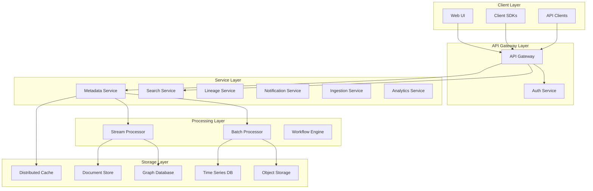
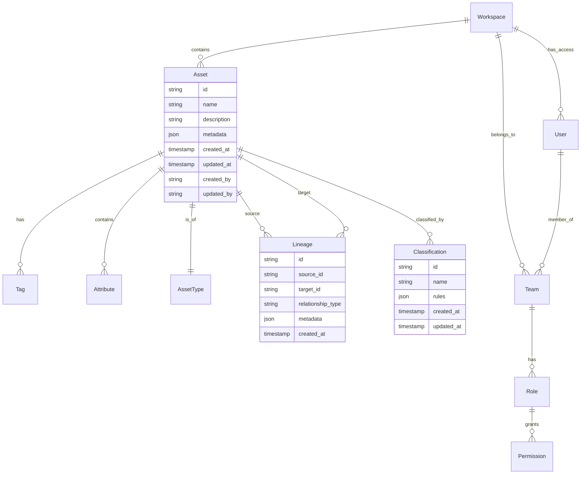
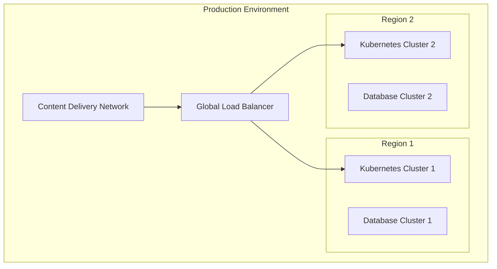

# Enterprise-Grade Metadata Platform Design Document

## Table of Contents
1. [Executive Summary](#executive-summary)
2. [System Requirements](#system-requirements)
3. [Architecture Overview](#architecture-overview)
4. [Component Design](#component-design)
5. [Data Model](#data-model)
6. [API Design](#api-design)
7. [Technology Stack](#technology-stack)
8. [Security & Compliance](#security--compliance)
9. [Deployment Strategy](#deployment-strategy)
10. [Scalability & Performance](#scalability--performance)
11. [Cost Optimization](#cost-optimization)
12. [Monitoring & Observability](#monitoring--observability)
13. [Future Enhancements](#future-enhancements)

## Executive Summary

The Enterprise-Grade Metadata Platform is designed to be a next-generation data catalog system that addresses the limitations of existing solutions while providing innovative features for modern data ecosystems. The platform is built to handle billions of metadata assets, support multi-tenancy, and enable programmatic integrations at enterprise scale.

### Key Differentiators
- Cloud-agnostic architecture with multi-cloud support
- Pluggable storage backends
- Real-time metadata processing
- AI-powered metadata enrichment
- Enterprise-grade security and compliance
- Extensible plugin architecture

## System Requirements

### Functional Requirements

1. **Metadata Management**
   - Asset registration and discovery
   - Relationship mapping and lineage tracking
   - Version control and history
   - Custom metadata attributes
   - Bulk operations support

2. **Search & Discovery**
   - Full-text search
   - Faceted search
   - Natural language queries
   - Advanced filtering
   - Semantic search capabilities

3. **Integration Capabilities**
   - REST APIs
   - GraphQL endpoints
   - Webhook support
   - Streaming interfaces
   - Batch processing

4. **Access Control**
   - Role-based access control (RBAC)
   - Attribute-based access control (ABAC)
   - Fine-grained permissions
   - Multi-tenancy support
   - SSO integration

### Non-Functional Requirements

1. **Performance**
   - Sub-second search response time
   - Support for billions of metadata assets
   - High throughput for batch operations
   - Low latency for real-time updates

2. **Scalability**
   - Horizontal scalability
   - Auto-scaling capabilities
   - Load balancing
   - Distributed processing

3. **Availability**
   - 99.99% uptime
   - Disaster recovery
   - Geographic redundancy
   - Zero-downtime updates

4. **Security**
   - End-to-end encryption
   - Audit logging
   - Compliance with industry standards
   - Data governance

## Architecture Overview



### Key Components

1. **API Gateway Layer**
   - Rate limiting
   - Request routing
   - Protocol translation
   - Authentication & Authorization

2. **Service Layer**
   - Microservices architecture
   - Domain-driven design
   - Event-driven communication
   - Service mesh integration

3. **Processing Layer**
   - Stream processing (Apache Kafka)
   - Batch processing (Apache Spark)
   - Workflow orchestration (Apache Airflow)

4. **Storage Layer**
   - Distributed caching (Redis)
   - Document store (MongoDB)
   - Graph database (Neo4j)
   - Object storage (S3-compatible)

## Data Model



## API Design

### REST APIs

```yaml
/api/v1:
  /assets:
    get: List assets
    post: Create asset
    /{id}:
      get: Get asset
      put: Update asset
      delete: Delete asset
  /lineage:
    get: Get lineage graph
    post: Add lineage
  /search:
    post: Search assets
  /ingestion:
    post: Start ingestion
    get: Get status
```

### GraphQL Schema

```graphql
type Asset {
  id: ID!
  name: String!
  description: String
  type: AssetType!
  metadata: JSON
  tags: [Tag!]
  attributes: [Attribute!]
  lineage: LineageConnection
  created_at: DateTime!
  updated_at: DateTime!
}

type LineageConnection {
  upstream: [Asset!]
  downstream: [Asset!]
}
```

## Technology Stack

### Core Technologies

1. **Backend Services**
   - Programming Language: Go
   - Framework: Go-kit
   - API Gateway: Kong
   - Service Mesh: Istio

2. **Data Processing**
   - Stream Processing: Apache Kafka
   - Batch Processing: Apache Spark
   - Workflow Engine: Apache Airflow

3. **Storage**
   - Primary Database: PostgreSQL
   - Graph Database: Neo4j
   - Document Store: MongoDB
   - Cache: Redis
   - Object Storage: MinIO

4. **Search**
   - Search Engine: Elasticsearch
   - Vector Search: Milvus

5. **Infrastructure**
   - Container Runtime: Kubernetes
   - Service Mesh: Istio
   - Monitoring: Prometheus + Grafana
   - Logging: ELK Stack
   - Tracing: Jaeger

## Security & Compliance

### Authentication & Authorization

1. **Identity Management**
   - OAuth 2.0 / OpenID Connect
   - SAML 2.0
   - JWT tokens
   - API keys

2. **Access Control**
   - RBAC (Role-Based Access Control)
   - ABAC (Attribute-Based Access Control)
   - Policy enforcement points
   - Tenant isolation

### Data Security

1. **Encryption**
   - Data at rest encryption
   - TLS 1.3 for data in transit
   - Key management service
   - Hardware security modules (HSM)

2. **Audit & Compliance**
   - Comprehensive audit logs
   - GDPR compliance
   - CCPA compliance
   - SOC 2 compliance

## Deployment Strategy

### Infrastructure as Code



### Deployment Models

1. **Single-Region Deployment**
   - Suitable for small to medium enterprises
   - Lower operational costs
   - Simplified management

2. **Multi-Region Deployment**
   - Global data distribution
   - Disaster recovery
   - Low latency access
   - Geographic redundancy

3. **Hybrid Deployment**
   - On-premises components
   - Cloud integration
   - Data sovereignty compliance

## Scalability & Performance

### Horizontal Scaling

1. **Service Scaling**
   - Automatic scaling based on metrics
   - Load-based scaling
   - Scheduled scaling
   - Manual scaling capability

2. **Database Scaling**
   - Read replicas
   - Sharding
   - Partitioning
   - Connection pooling

### Performance Optimization

1. **Caching Strategy**
   - Multi-level caching
   - Cache invalidation
   - Cache warming
   - Cache coherence

2. **Query Optimization**
   - Query planning
   - Index optimization
   - Query caching
   - Materialized views

## Cost Optimization

### Infrastructure Costs

1. **Compute Optimization**
   - Right-sizing instances
   - Spot instances usage
   - Auto-scaling policies
   - Resource quotas

2. **Storage Optimization**
   - Tiered storage
   - Data lifecycle policies
   - Compression
   - Deduplication

### Operational Costs

1. **Automation**
   - CI/CD pipelines
   - Infrastructure as Code
   - Automated testing
   - Self-healing systems

2. **Resource Management**
   - Cost allocation
   - Budget alerts
   - Usage monitoring
   - Waste elimination

## Monitoring & Observability

### Metrics Collection

1. **System Metrics**
   - CPU usage
   - Memory utilization
   - Network throughput
   - Disk I/O

2. **Application Metrics**
   - Request latency
   - Error rates
   - Throughput
   - Success rates

### Logging & Tracing

1. **Log Management**
   - Centralized logging
   - Log retention policies
   - Log analysis
   - Alert generation

2. **Distributed Tracing**
   - Request tracing
   - Performance profiling
   - Bottleneck identification
   - Error tracking

## Future Enhancements

### AI Integration

1. **Metadata Enrichment**
   - Automatic tagging
   - Content classification
   - Relationship inference
   - Quality assessment

2. **Search Enhancement**
   - Natural language processing
   - Semantic search
   - Recommendation engine
   - Relevance ranking

### Advanced Analytics

1. **Usage Analytics**
   - Asset usage patterns
   - User behavior analysis
   - Impact analysis
   - Trend detection

2. **Data Quality**
   - Quality scoring
   - Anomaly detection
   - Validation rules
   - Quality monitoring

## Conclusion

This design document outlines a comprehensive approach to building an enterprise-grade metadata platform that addresses the key challenges while providing innovative features for modern data ecosystems. The architecture is designed to be scalable, secure, and extensible, with a focus on performance and cost optimization.

The platform's modular design and use of industry-standard technologies ensure that it can evolve with changing requirements while maintaining backward compatibility and operational efficiency. The emphasis on automation, observability, and self-service capabilities makes it suitable for large-scale enterprise deployments.
