# Enterprise-Grade Metadata Platform Design Document


## Table of Contents

1. [Introduction](#introduction)
2. [System Requirements](#system-requirements)
3. [Architecture Overview](#architecture-overview)
4. [Component Design](#component-design)
5. [Data Model](#data-model)
6. [API Design](#api-design)
7. [Technology Stack](#technology-stack)
8. [Security & Compliance](#security--compliance)
9. [Deployment Strategy](#deployment-strategy)
10. [Scalability & Performance](#scalability--performance)
11. [Cost Optimization](#cost-optimization)
12. [Monitoring & Observability](#monitoring--observability)
13. [Future Enhancements](#future-enhancements)
14. [Key Architectural Considerations](#key-architectural-considerations)


## Introduction

The MetaPlatform is an enterprise-grade metadata management system designed to address the challenges of modern data ecosystems. It provides comprehensive tools for managing, searching, and analyzing metadata across diverse data sources. Built with scalability, security, and extensibility in mind, the platform supports multi-tenancy and integrates seamlessly with cloud-native and on-premises environments.

## System Requirements

### Functional Requirements

1. **Metadata Management**
   - Asset registration and discovery
   - Relationship mapping and lineage tracking
   - Version control and history
   - Custom metadata attributes
   - Bulk operations support

2. **Search & Discovery**
   - Full-text search
   - Faceted search
   - Natural language queries
   - Advanced filtering
   - Semantic search capabilities

3. **Integration Capabilities**
   - REST APIs
   - Webhook support
   - Streaming interfaces
   - Batch processing

4. **Access Control**
   - Role-based access control (RBAC)
   - Attribute-based access control (ABAC)
   - Fine-grained permissions
   - Multi-tenancy support
   - SSO integration

### Non-Functional Requirements

1. **Performance**
   - Sub-second search response time
   - Support for billions of metadata assets
   - High throughput for batch operations
   - Low latency for real-time updates

2. **Scalability**
   - Horizontal scalability
   - Auto-scaling capabilities
   - Load balancing
   - Distributed processing

3. **Availability**
   - 99.99% uptime
   - Disaster recovery
   - Geographic redundancy
   - Zero-downtime updates

4. **Security**
   - End-to-end encryption
   - Audit logging
   - Compliance with industry standards
   - Data governance

## Architecture Overview

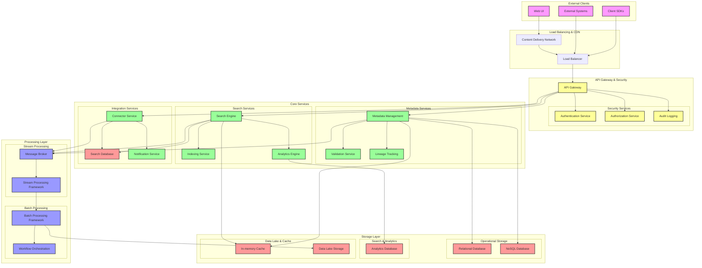
```mermaid
graph TB
    subgraph "External Clients"
        WEB["Web UI"]
        SDK["Client SDKs"]
        EXT["External Systems"]
    end

    subgraph "Load Balancing & CDN"
        CDN["Content Delivery Network"]
        LB["Load Balancer"]
    end

    subgraph "API Gateway & Security"
        AG["API Gateway"]
        subgraph "Security Services"
            AUTH["Authentication Service"]
            AUTHZ["Authorization Service"]
            AUDIT["Audit Logging"]
        end
    end

    subgraph "Core Services"
        subgraph "Metadata Services"
            MS["Metadata Management"]
            VS["Validation Service"]
            LS["Lineage Tracking"]
        end
        
        subgraph "Search Services"
            SS["Search Engine"]
            IS["Indexing Service"]
            AS["Analytics Engine"]
        end
        
        subgraph "Integration Services"
            CS["Connector Service"]
            ES["Event Processing"]
            NS["Notification Service"]
        end
    end

    subgraph "Processing Layer"
        subgraph "Stream Processing"
            KFK["Message Broker"]
            KST["Stream Processing Framework"]
        end
        
        subgraph "Batch Processing"
            BATCH["Batch Processing Framework"]
            AWF["Workflow Orchestration"]
        end
    end

    subgraph "Storage Layer"
        subgraph "Operational Storage"
            PG["Relational Database"]
            DYNAMO["NoSQL Database"]
        end
        
        subgraph "Search & Analytics"
            ES["Search Database"]
            CH["Analytics Database"]
        end
        
        subgraph "Data Lake & Cache"
            RD["In-memory Cache"]
            S3["Data Lake Storage"]
        end
    end

    %% Client Connections
    WEB --> CDN
    SDK --> LB
    EXT --> LB
    CDN --> LB
    
    %% Gateway & Security
    LB --> AG
    AG --> AUTH
    AG --> AUTHZ
    AG --> AUDIT
    
    %% Core Services Connections
    AG --> MS
    AG --> SS
    AG --> CS
    
    %% Service Interactions
    MS --> VS
    MS --> LS
    SS --> IS
    SS --> AS
    CS --> ES
    CS --> NS
    
    %% Processing Layer
    MS --> KFK
    SS --> KFK
    CS --> KFK
    KFK --> KST
    KST --> BATCH
    BATCH --> AWF
    
    %% Storage Layer
    MS --> PG
    MS --> DYNAMO
    SS --> ES
    AS --> CH
    MS --> RD
    SS --> RD
    BATCH --> S3

    classDef external fill:#f9f,stroke:#333,stroke-width:2px
    classDef gateway fill:#ff9,stroke:#333,stroke-width:2px
    classDef core fill:#9f9,stroke:#333,stroke-width:2px
    classDef processing fill:#99f,stroke:#333,stroke-width:2px
    classDef storage fill:#f99,stroke:#333,stroke-width:2px
    
    class WEB,SDK,EXT external
    class AG,AUTH,AUTHZ,AUDIT gateway
    class MS,VS,LS,SS,IS,AS,CS,ES,NS core
    class KFK,KST,BATCH,AWF processing
    class PG,DYNAMO,ES,CH,RD,S3 storage
```

### Data Flow

1. **Ingestion Flow**
   ```mermaid
   sequenceDiagram
       participant Source
       participant Connector
       participant Kafka
       participant Flink
       participant Storage
       
       Source->>Connector: Raw Data
       Connector->>Kafka: Structured Events
       Kafka->>Flink: Stream Processing
       Flink->>Storage: Processed Data
   ```

2. **Query Flow**
   ```mermaid
   sequenceDiagram
       participant Client
       participant Gateway
       participant Cache
       participant Service
       participant Storage
       
       Client->>Gateway: Request
       Gateway->>Cache: Check Cache
       Cache-->>Gateway: Cache Miss
       Gateway->>Service: Process Request
       Service->>Storage: Query Data
       Storage-->>Service: Data
       Service-->>Gateway: Response
       Gateway-->>Client: Final Response
   ```

### Component Details

1. **Core Services**
   - Metadata Service: Asset management, versioning
   - Validation Service: Data quality, schema validation
   - Lineage Service: Data lineage tracking
   - Search Service: Full-text and vector search
   - Analytics Service: Real-time metrics and analytics

2. **Integration Layer**
   - Event-driven architecture
   - Real-time streaming with Kafka
   - Batch processing with Spark
   - Workflow orchestration with Airflow

3. **Storage Strategy**
   - PostgreSQL + pgvector: Structured data and vector embeddings
   - DynamoDB: High-throughput metadata
   - S3: Data lake storage
   - Elasticsearch: Full-text search
   - ClickHouse: Real-time analytics
   - Redis: Caching layer

### Security Architecture

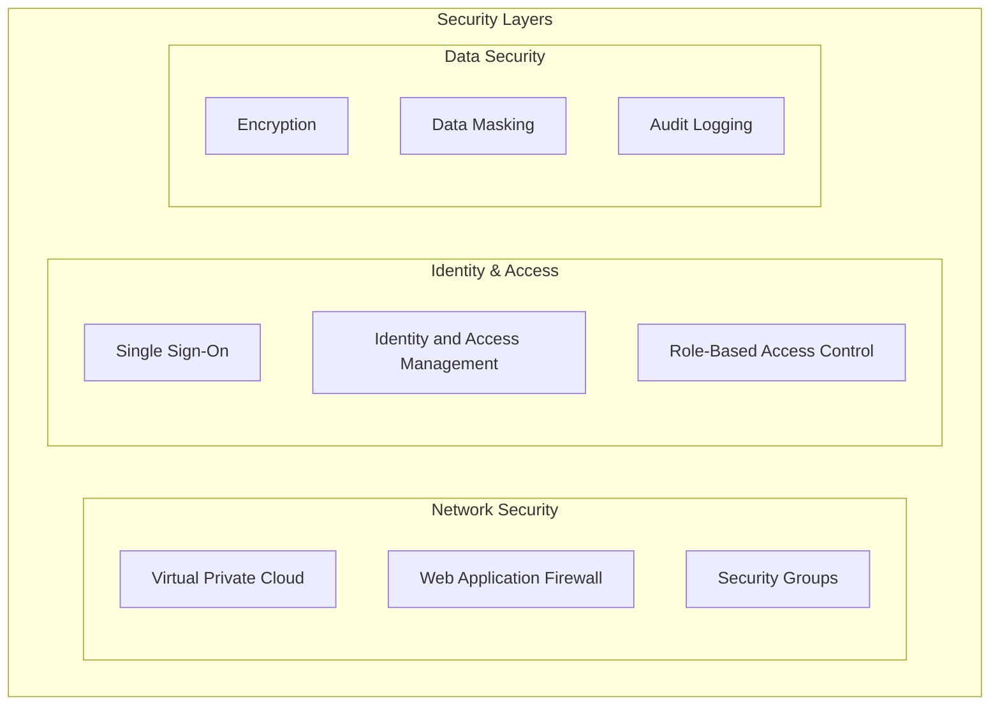
```mermaid
graph TB
    subgraph "Security Layers"
        subgraph "Network Security"
            VPC["Virtual Private Cloud"]
            WAF["Web Application Firewall"]
            SG["Security Groups"]
        end
        
        subgraph "Identity & Access"
            SSO["Single Sign-On"]
            IAM["Identity and Access Management"]
            RBAC["Role-Based Access Control"]
        end
        
        subgraph "Data Security"
            ENC["Encryption"]
            MASK["Data Masking"]
            AUDIT["Audit Logging"]
        end
    end
```

### Deployment Architecture

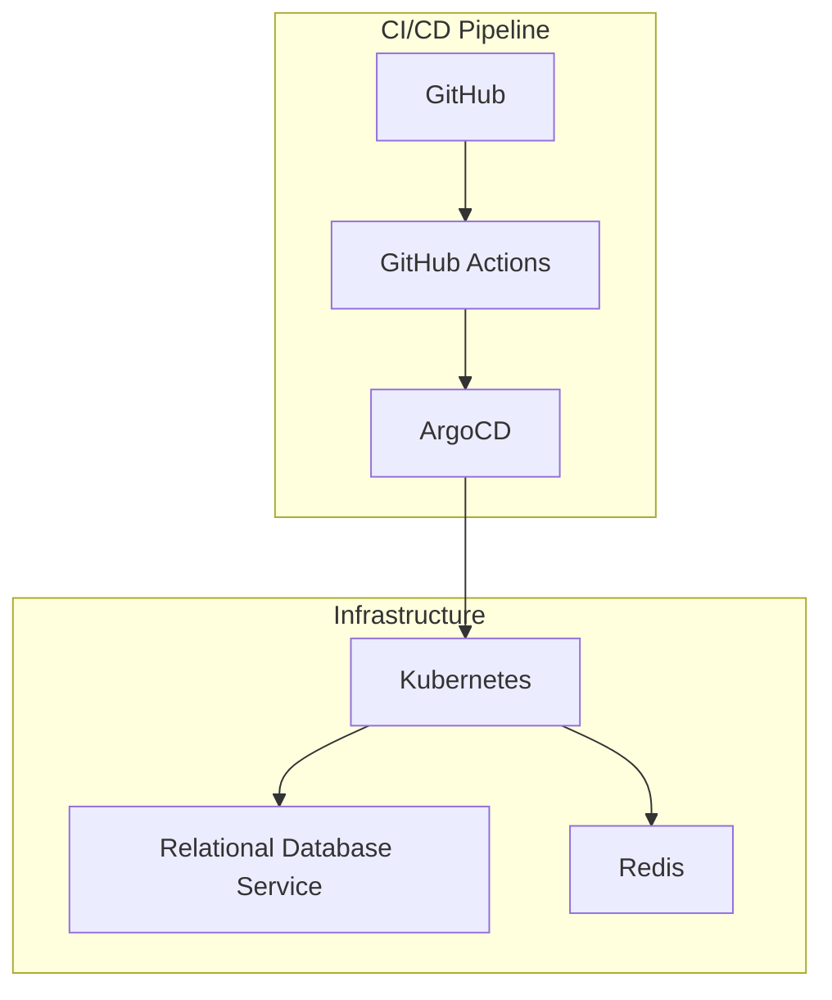
```mermaid
graph TB
    subgraph "CI/CD Pipeline"
        GH["GitHub"]
        ACT["GitHub Actions"]
        ARGO["ArgoCD"]
        
        GH --> ACT
        ACT --> ARGO
    end
    
    subgraph "Infrastructure"
        K8S["Kubernetes"]
        RDS["Relational Database Service"]
        CACHE["Redis"]
        
        ARGO --> K8S
        K8S --> RDS
        K8S --> CACHE
    end
```

## Component Design

### Core Components

1. **Metadata Service**
   - Asset registration and discovery
   - Relationship mapping and lineage tracking
   - Version control and history
   - Custom metadata attributes
   - Bulk operations support

2. **Validation Service**
   - Data quality checks
   - Schema validation
   - Data normalization

3. **Lineage Service**
   - Data lineage tracking
   - Data provenance
   - Data dependency analysis

4. **Search Service**
   - Full-text search
   - Faceted search
   - Natural language queries
   - Advanced filtering
   - Semantic search capabilities

5. **Analytics Service**
   - Real-time metrics and analytics
   - Data aggregation and grouping
   - Data filtering and sorting

### Integration Components

1. **Connector Service**
   - Event-driven architecture
   - Real-time streaming with Kafka
   - Batch processing with Spark
   - Workflow orchestration with Airflow

2. **Event Service**
   - Event handling and processing
   - Event routing and filtering
   - Event storage and retrieval

3. **Notification Service**
   - Notification handling and processing
   - Notification routing and filtering
   - Notification storage and retrieval

## Data Model

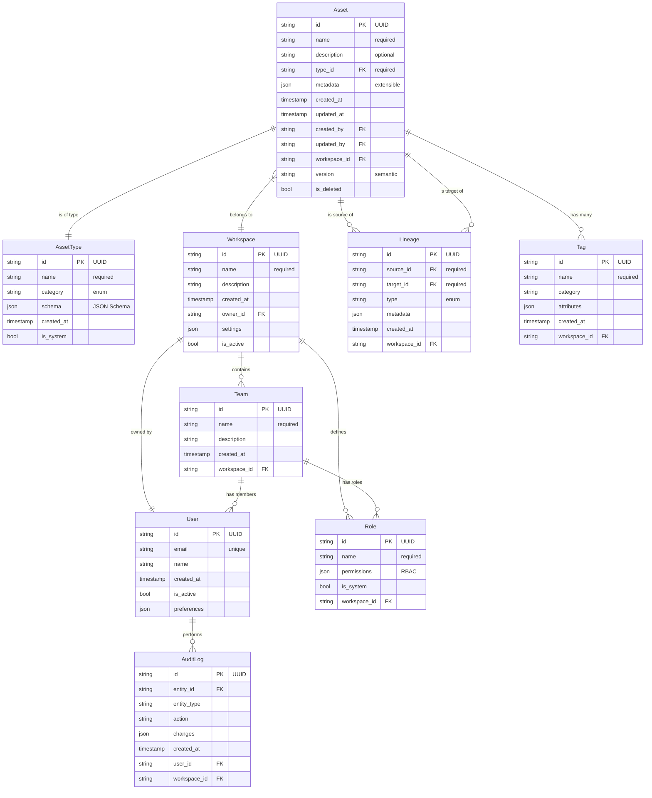
```mermaid
erDiagram
    %% Core Entities
    Asset {
        string id PK "UUID"
        string name "required"
        string description "optional"
        string type_id FK "required"
        json metadata "extensible"
        timestamp created_at
        timestamp updated_at
        string created_by FK
        string updated_by FK
        string workspace_id FK
        string version "semantic"
        bool is_deleted
    }

    AssetType {
        string id PK "UUID"
        string name "required"
        string category "enum"
        json schema "JSON Schema"
        timestamp created_at
        bool is_system
    }

    Workspace {
        string id PK "UUID"
        string name "required"
        string description
        timestamp created_at
        string owner_id FK
        json settings
        bool is_active
    }

    %% Relationship Entities
    Lineage {
        string id PK "UUID"
        string source_id FK "required"
        string target_id FK "required"
        string type "enum"
        json metadata
        timestamp created_at
        string workspace_id FK
    }

    Tag {
        string id PK "UUID"
        string name "required"
        string category
        json attributes
        timestamp created_at
        string workspace_id FK
    }

    %% Security Entities
    User {
        string id PK "UUID"
        string email "unique"
        string name
        timestamp created_at
        bool is_active
        json preferences
    }

    Team {
        string id PK "UUID"
        string name "required"
        string description
        timestamp created_at
        string workspace_id FK
    }

    Role {
        string id PK "UUID"
        string name "required"
        json permissions "RBAC"
        bool is_system
        string workspace_id FK
    }

    %% Audit Entities
    AuditLog {
        string id PK "UUID"
        string entity_id FK
        string entity_type
        string action
        json changes
        timestamp created_at
        string user_id FK
        string workspace_id FK
    }

    %% Relationships with corrected cardinality
    Asset ||--|| AssetType : "is of type"
    Asset ||--o{ Tag : "has many"
    Asset ||--o{ Lineage : "is source of"
    Asset ||--o{ Lineage : "is target of"
    Asset }|--|| Workspace : "belongs to"
    
    Workspace ||--o{ Team : "contains"
    Workspace ||--o{ Role : "defines"
    Workspace ||--|| User : "owned by"
    
    Team ||--o{ User : "has members"
    Team ||--o{ Role : "has roles"
    
    User ||--o{ AuditLog : "performs"
```

### Entity Descriptions

1. **Core Entities**
   - `Asset`: Central entity representing any metadata object
   - `AssetType`: Defines the schema and behavior of assets
   - `Workspace`: Multi-tenant isolation boundary

2. **Relationship Entities**
   - `Lineage`: Tracks data flow and dependencies
   - `Tag`: Flexible categorization and labeling

3. **Security Entities**
   - `User`: Platform user information
   - `Team`: Organizational grouping
   - `Role`: Permission sets and access control

4. **Audit Entities**
   - `AuditLog`: Comprehensive change tracking

### Key Design Decisions

1. **Multi-tenancy**
   - Workspace-based isolation
   - Hierarchical resource organization
   - Cross-workspace references supported

2. **Extensibility**
   - JSON metadata fields for flexibility
   - Custom attributes via schema
   - Pluggable type system

3. **Versioning**
   - Semantic versioning for assets
   - Full audit history
   - Soft deletion support

4. **Security**
   - Fine-grained RBAC
   - Team-based access control
   - Audit logging for compliance

## API Design

### OpenAPI Specification

```yaml
openapi: 3.0.3
info:
  title: MetaPlatform API
  description: Enterprise Metadata Platform API
  version: 1.0.0
  contact:
    name: MetaPlatform Team
    url: https://metaplatform.io
  license:
    name: Proprietary
    
servers:
  - url: https://api.metaplatform.io/v1
    description: Production server
  - url: https://staging-api.metaplatform.io/v1
    description: Staging server

security:
  - bearerAuth: []
  - apiKeyAuth: []

components:
  securitySchemes:
    bearerAuth:
      type: http
      scheme: bearer
      bearerFormat: JWT
    apiKeyAuth:
      type: apiKey
      in: header
      name: X-API-Key

  schemas:
    Asset:
      type: object
      required:
        - id
        - name
        - type
        - workspaceId
      properties:
        id:
          type: string
          format: uuid
        name:
          type: string
          maxLength: 255
        description:
          type: string
        type:
          type: string
          enum: [table, dashboard, pipeline, model, api]
        workspaceId:
          type: string
          format: uuid
        metadata:
          type: object
          additionalProperties: true
        tags:
          type: array
          items:
            type: string
        owner:
          type: string
        created:
          type: string
          format: date-time
        updated:
          type: string
          format: date-time
        version:
          type: integer
          minimum: 1

    AssetCreate:
      type: object
      required:
        - name
        - type
        - workspaceId
      properties:
        name:
          type: string
          maxLength: 255
        description:
          type: string
        type:
          type: string
          enum: [table, dashboard, pipeline, model, api]
        workspaceId:
          type: string
          format: uuid
        metadata:
          type: object
          additionalProperties: true
        tags:
          type: array
          items:
            type: string

    LineageGraph:
      type: object
      properties:
        nodes:
          type: array
          items:
            $ref: '#/components/schemas/Asset'
        edges:
          type: array
          items:
            type: object
            properties:
              source:
                type: string
                format: uuid
              target:
                type: string
                format: uuid
              relationship:
                type: string
              metadata:
                type: object
                additionalProperties: true

    SearchRequest:
      type: object
      properties:
        query:
          type: string
        filters:
          type: object
          properties:
            types:
              type: array
              items:
                type: string
            tags:
              type: array
              items:
                type: string
            workspaceIds:
              type: array
              items:
                type: string
                format: uuid
        pagination:
          type: object
          properties:
            page:
              type: integer
              minimum: 1
            size:
              type: integer
              minimum: 1
              maximum: 100

    SearchResponse:
      type: object
      properties:
        items:
          type: array
          items:
            $ref: '#/components/schemas/Asset'
        total:
          type: integer
        page:
          type: integer
        size:
          type: integer

    Error:
      type: object
      properties:
        code:
          type: string
        message:
          type: string
        details:
          type: object
          additionalProperties: true
        traceId:
          type: string
```

### API Features

1. **Authentication & Authorization**
   - JWT Bearer token authentication
   - API Key authentication
   - Role-based access control

2. **Versioning & Compatibility**
   - URL-based versioning (/v1)
   - Backward compatibility guarantees
   - Deprecation notices

3. **Error Handling**
   - Standardized error responses
   - Detailed error messages
   - Request tracing

4. **Rate Limiting & Quotas**
   - Per-client rate limits
   - Usage quotas
   - Burst handling

5. **Documentation**
   - OpenAPI/Swagger specification
   - Interactive API documentation
   - Code samples and SDKs

## Technology Stack

### Core Technologies

1. **Backend Framework**
   - Java 17
   - Spring Boot 3.x
   - Spring Cloud for microservices
   - Spring Security for authentication and authorization

2. **API Gateway & Security**
   - API Gateway
   - Authentication Service for user authentication
   - Authorization Service for access control

3. **Data Storage**
   - Relational Database for structured data
   - NoSQL Database for high-throughput metadata
   - Data Lake Storage for object storage
   - Search Database for full-text search
   - Analytics Database for real-time analytics
   - In-memory Cache for caching layer

4. **Search & Analytics**
   - Search Engine for full-text search
   - Analytics Engine for real-time metrics and analytics

5. **Compute & Containers**
   - Kubernetes for container orchestration

6. **Caching**
   - In-memory Cache

7. **Monitoring & Logging**
   - Prometheus for system metrics
   - Grafana for visualization
   - AlertManager for alerting
   - Logging Stack for log management

8. **CI/CD & DevOps**
   - GitHub Actions for CI/CD
   - ArgoCD for continuous delivery

9. **Networking & Content Delivery**
   - Content Delivery Network for content delivery
   - Load Balancer for load balancing

### Data Processing

1. **Stream Processing**
   - Message Broker for event-driven architecture
   - Stream Processing Framework for real-time processing

2. **Batch Processing**
   - Batch Processing Framework for large-scale data processing
   - Workflow Orchestration for workflow management

### Development Tools

1. **Build & Dependency Management**
   - Maven or Gradle
   - Docker for containerization

2. **Testing Frameworks**
   - JUnit 5
   - Mockito
   - Testcontainers for integration testing

3. **Documentation**
   - OpenAPI/Swagger for API documentation

### Additional Considerations

1. **Performance Optimization**
   - JVM Tuning
   - Reactive Programming with Project Reactor
   - Caching Strategies

2. **Security Enhancements**
   - Static Code Analysis and OWASP Dependency with SonarQube
   - DecSecOps for secure development

## Security & Compliance

### Authentication & Authorization

1. **Identity Management**
   - OAuth 2.0 / OpenID Connect /SAML 2.0 for SSO
   - JWT tokens for user authentication

2. **Access Control**
   - RBAC (Role-Based Access Control)
   - Tenant isolation

### Data Security

1. **Encryption**
   - Data at rest encryption
   - TLS 1.3 for data in transit
   - Key management service for encryption keys
   - Data masking

2. **Audit & Compliance**
   - Centralized audit logs
   - Compliance (GDPR, SOC2, ISO27001...)

## Deployment Strategy

### Infrastructure Overview

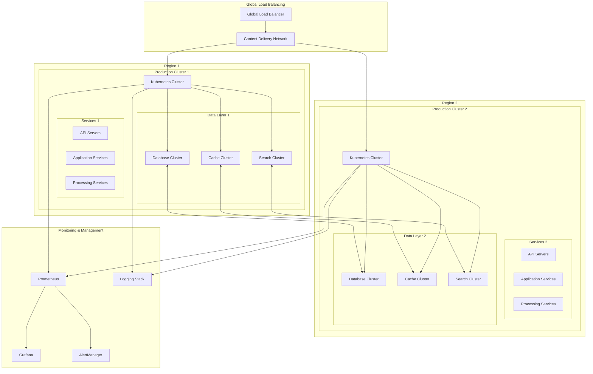
```mermaid
graph TB
    subgraph "Global Load Balancing"
        GLB["Global Load Balancer"]
        CDN["Content Delivery Network"]
    end

    subgraph "Region 1"
        subgraph "Production Cluster 1"
            K8S1["Kubernetes Cluster"]
            subgraph "Services 1"
                API1["API Servers"]
                APP1["Application Services"]
                PROC1["Processing Services"]
            end
            subgraph "Data Layer 1"
                DB1["Database Cluster"]
                CACHE1["Cache Cluster"]
                SEARCH1["Search Cluster"]
            end
        end
    end

    subgraph "Region 2"
        subgraph "Production Cluster 2"
            K8S2["Kubernetes Cluster"]
            subgraph "Services 2"
                API2["API Servers"]
                APP2["Application Services"]
                PROC2["Processing Services"]
            end
            subgraph "Data Layer 2"
                DB2["Database Cluster"]
                CACHE2["Cache Cluster"]
                SEARCH2["Search Cluster"]
            end
        end
    end

    subgraph "Monitoring & Management"
        PROM["Prometheus"]
        GRAF["Grafana"]
        ALERT["AlertManager"]
        LOG["Logging Stack"]
    end

    GLB --> CDN
    CDN --> K8S1
    CDN --> K8S2
    
    K8S1 --> DB1
    K8S1 --> CACHE1
    K8S1 --> SEARCH1
    
    K8S2 --> DB2
    K8S2 --> CACHE2
    K8S2 --> SEARCH2
    
    DB1 <--> DB2
    CACHE1 <--> CACHE2
    SEARCH1 <--> SEARCH2
    
    K8S1 --> PROM
    K8S2 --> PROM
    PROM --> GRAF
    PROM --> ALERT
    
    K8S1 --> LOG
    K8S2 --> LOG
```

### Deployment Models

1. **Single-Region Deployment**
   - Suitable for small to medium enterprises
   - Lower operational costs
   - Simplified management
   - Basic disaster recovery

2. **Multi-Region Active-Active**
   - Global data distribution
   - Low-latency access
   - High availability
   - Disaster recovery
   - Geographic redundancy

3. **Multi-Region Active-Passive**
   - Primary region for writes
   - Read replicas in secondary regions
   - Automated failover
   - Data sovereignty compliance

### Deployment Process

1. **Infrastructure Provisioning**
   - Terraform for infrastructure as code
   - CloudFormation for resource management

2. **Application Deployment**
   - Docker for containerization
   - Kubernetes for orchestration
   - Helm for package management
   - ArgoCD for CI/CD

3. **Release Strategy**
   - Blue-Green deployments
   - Canary releases
   - Feature flags
   - Rollback procedures

### Scaling Strategy

1. **Horizontal Scaling**
   - Auto-scaling policies
   - Load-based scaling
   - Scheduled scaling
   - Resource quotas

2. **Vertical Scaling**
   - Resource allocation
   - Performance tuning
   - Capacity planning
   - Cost optimization

3. **Data Scaling**
   - Sharding strategy
   - Replication setup
   - Backup procedures
   - Archive policies

## Scalability & Performance

### Performance Optimization

1. **Caching Strategy**
   - Multi-level caching
   - Cache invalidation
   - Cache warming
   - Cache coherence

2. **Query Optimization**
   - Query planning
   - Index optimization
   - Query caching
   - Materialized views

## Cost Optimization

### Infrastructure Costs

1. **Compute Optimization**
   - Right-sizing instances
   - Spot instances usage
   - Auto-scaling policies
   - Resource quotas

2. **Storage Optimization**
   - Tiered storage
   - Data lifecycle policies
   - Compression
   - Deduplication

### Operational Costs

1. **Automation**
   - CI/CD pipelines
   - Infrastructure as Code
   - Automated testing
   - Self-healing systems

2. **Resource Management**
   - Cost allocation
   - Budget alerts
   - Usage monitoring
   - Waste elimination

## Monitoring & Observability

### Metrics Collection

1. **System Metrics**
   - CPU usage
   - Memory utilization
   - Network throughput
   - Disk I/O

2. **Application Metrics**
   - Request latency
   - Error rates
   - Throughput
   - Success rates

### Logging & Tracing

1. **Log Management**
   - Centralized logging
   - Log retention policies
   - Log analysis
   - Alert generation

2. **Distributed Tracing**
   - Request tracing
   - Performance profiling
   - Bottleneck identification
   - Error tracking

## Key Architectural Considerations

### 1. Background Task Management

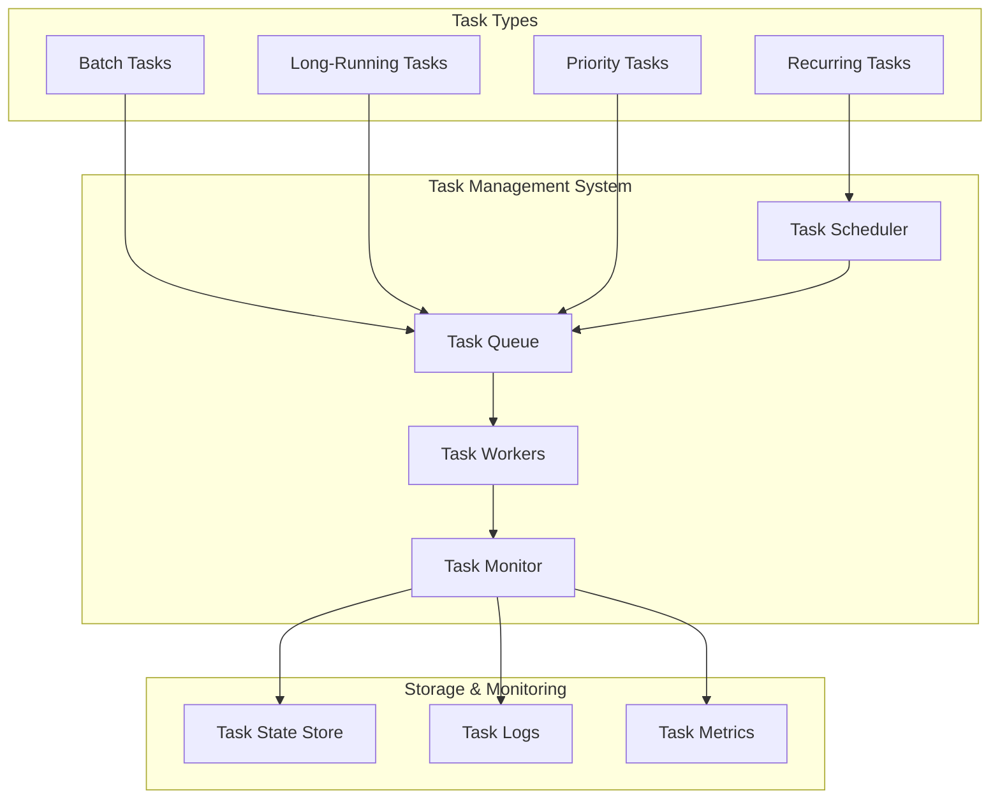
```mermaid
graph TB
    subgraph "Task Management System"
        TS["Task Scheduler"]
        TQ["Task Queue"]
        TW["Task Workers"]
        TM["Task Monitor"]
    end

    subgraph "Task Types"
        BT["Batch Tasks"]
        LRT["Long-Running Tasks"]
        RT["Recurring Tasks"]
        PT["Priority Tasks"]
    end

    subgraph "Storage & Monitoring"
        TS_DB["Task State Store"]
        TL["Task Logs"]
        TM_DB["Task Metrics"]
    end

    BT --> TQ
    LRT --> TQ
    RT --> TS
    PT --> TQ
    
    TS --> TQ
    TQ --> TW
    TW --> TM
    TM --> TS_DB
    TM --> TL
    TM --> TM_DB
```

#### Implementation Approach
1. **Task Scheduling System**
   - Utilize Temporal for workflow orchestration
   - Implement priority queues for task management
   - Support for task cancellation and pause/resume

2. **Task Types**
   - Batch processing tasks (data imports, exports)
   - Long-running tasks (data synchronization)
   - Recurring tasks (scheduled updates)
   - Priority-based task execution

3. **Monitoring & Recovery**
   - Task progress tracking
   - Automatic retry mechanisms
   - Dead letter queues for failed tasks
   - Task timeout handling

### 2. Authentication and Authorization

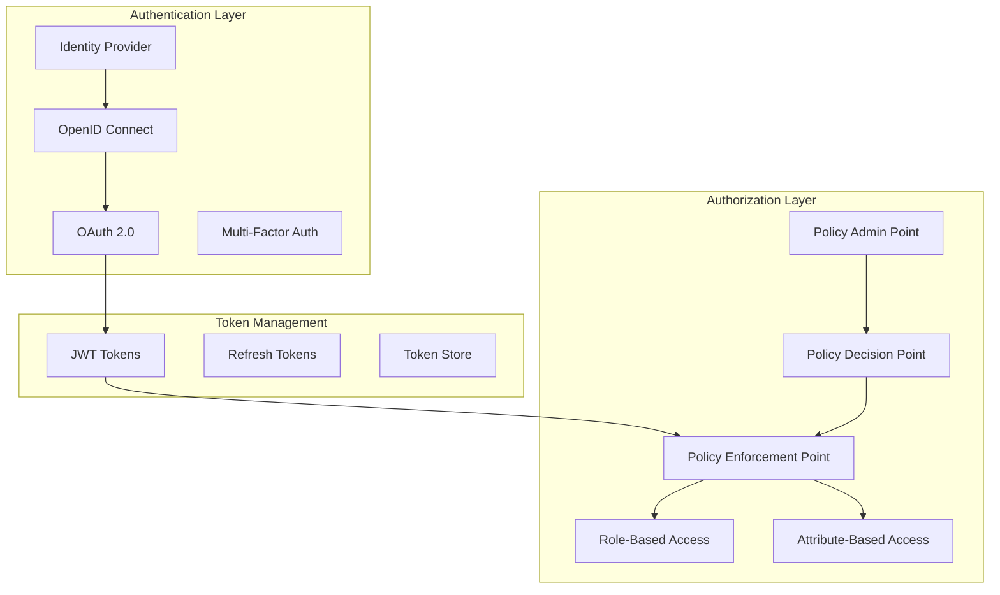
```mermaid
graph TB
    subgraph "Authentication Layer"
        IDP["Identity Provider"]
        OIDC["OpenID Connect"]
        OAuth["OAuth 2.0"]
        MFA["Multi-Factor Auth"]
    end

    subgraph "Authorization Layer"
        RBAC["Role-Based Access"]
        ABAC["Attribute-Based Access"]
        PAP["Policy Admin Point"]
        PDP["Policy Decision Point"]
        PEP["Policy Enforcement Point"]
    end

    subgraph "Token Management"
        JWT["JWT Tokens"]
        RT["Refresh Tokens"]
        TS["Token Store"]
    end

    IDP --> OIDC
    OIDC --> OAuth
    OAuth --> JWT
    JWT --> PEP
    
    PAP --> PDP
    PDP --> PEP
    PEP --> RBAC
    PEP --> ABAC
```

#### Implementation Approach
1. **Authentication**
   - Support multiple identity providers
   - JWT-based token management
   - Session management and refresh tokens
   - MFA support

2. **Authorization**
   - Fine-grained RBAC/ABAC
   - Policy-based access control
   - Resource-level permissions
   - Dynamic policy evaluation

### 3. Multiple Stores and Consistency

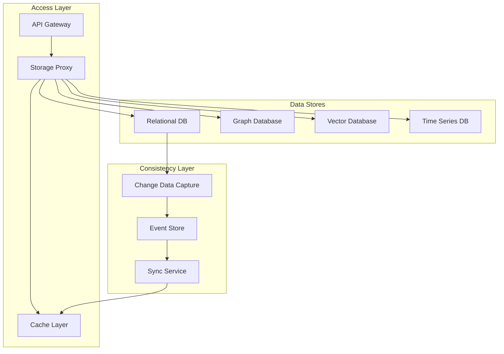
```mermaid
graph TB
    subgraph "Data Stores"
        RDB["Relational DB"]
        GDB["Graph Database"]
        VDB["Vector Database"]
        TSB["Time Series DB"]
    end

    subgraph "Consistency Layer"
        CDC["Change Data Capture"]
        ES["Event Store"]
        SYNC["Sync Service"]
    end

    subgraph "Access Layer"
        API["API Gateway"]
        CACHE["Cache Layer"]
        PROXY["Storage Proxy"]
    end

    API --> PROXY
    PROXY --> CACHE
    PROXY --> RDB
    PROXY --> GDB
    PROXY --> VDB
    PROXY --> TSB
    
    RDB --> CDC
    CDC --> ES
    ES --> SYNC
    SYNC --> CACHE
```

#### Implementation Approach
1. **Storage Strategy**
   - Relational DB for structured metadata
   - Graph DB for relationships
   - Document store for flexible schemas
   - Search engine for full-text search

2. **Consistency Management**
   - Event-sourcing for change tracking
   - CDC for real-time synchronization
   - Eventual consistency model
   - Conflict resolution strategies

### 4. Data Model and Relationships

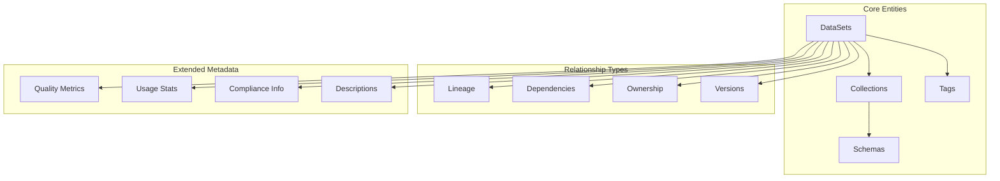
```mermaid
graph TB
    subgraph "Core Entities"
        DS["DataSets"]
        COL["Collections"]
        SCHEMA["Schemas"]
        TAG["Tags"]
    end

    subgraph "Relationship Types"
        LIN["Lineage"]
        DEP["Dependencies"]
        OWN["Ownership"]
        VER["Versions"]
    end

    subgraph "Extended Metadata"
        QUAL["Quality Metrics"]
        USAGE["Usage Stats"]
        COMP["Compliance Info"]
        DESC["Descriptions"]
    end

    DS --> COL
    COL --> SCHEMA
    DS --> TAG
    
    DS --> LIN
    DS --> DEP
    DS --> OWN
    DS --> VER
    
    DS --> QUAL
    DS --> USAGE
    DS --> COMP
    DS --> DESC
```

#### Implementation Approach
1. **Core Entities**
   - Flexible schema design
   - Version control support
   - Extensible attribute system
   - Custom metadata fields

2. **Relationships**
   - Bidirectional relationship tracking
   - Relationship metadata
   - Temporal relationships
   - Impact analysis support

### 5. Audit System

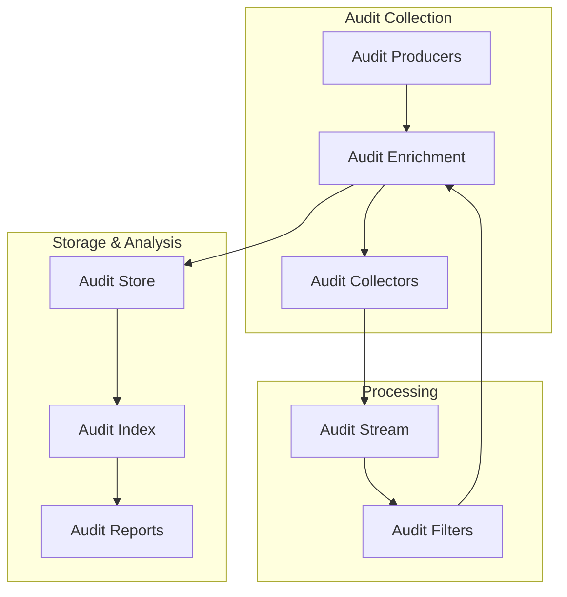
```mermaid
graph TB
    subgraph "Audit Collection"
        AE["Audit Events"]
        AP["Audit Producers"]
        AC["Audit Collectors"]
    end

    subgraph "Processing"
        AS["Audit Stream"]
        AF["Audit Filters"]
        AE["Audit Enrichment"]
    end

    subgraph "Storage & Analysis"
        ADB["Audit Store"]
        AI["Audit Index"]
        AR["Audit Reports"]
    end

    AP --> AE
    AE --> AC
    AC --> AS
    AS --> AF
    AF --> AE
    AE --> ADB
    ADB --> AI
    AI --> AR
```

#### Implementation Approach
1. **Event Collection**
   - Comprehensive event logging
   - Structured audit events
   - Real-time collection
   - Tamper-proof storage

2. **Processing & Analysis**
   - Event correlation
   - Pattern detection
   - Compliance reporting
   - Retention policies

### 6. Multi-Tenancy Support

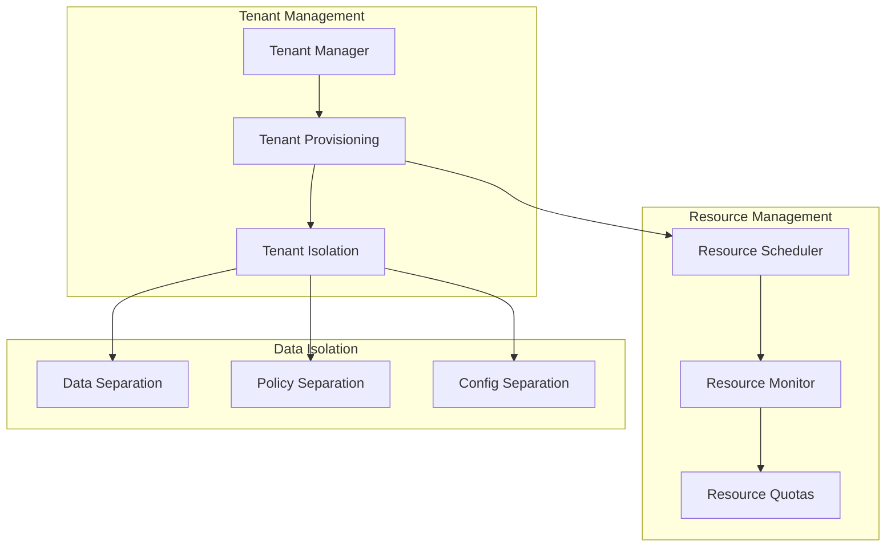
```mermaid
graph TB
    subgraph "Tenant Management"
        TM["Tenant Manager"]
        TP["Tenant Provisioning"]
        TI["Tenant Isolation"]
    end

    subgraph "Resource Management"
        RS["Resource Scheduler"]
        RM["Resource Monitor"]
        RQ["Resource Quotas"]
    end

    subgraph "Data Isolation"
        DS["Data Separation"]
        PS["Policy Separation"]
        CS["Config Separation"]
    end

    TM --> TP
    TP --> TI
    TI --> DS
    TI --> PS
    TI --> CS
    
    TP --> RS
    RS --> RM
    RM --> RQ
```

#### Implementation Approach
1. **Tenant Isolation**
   - Database-level isolation
   - Network isolation
   - Resource quotas
   - Configuration isolation

2. **Resource Management**
   - Usage monitoring
   - Cost allocation
   - Performance isolation
   - Scaling policies

### 7. Cloud Agnostic Architecture

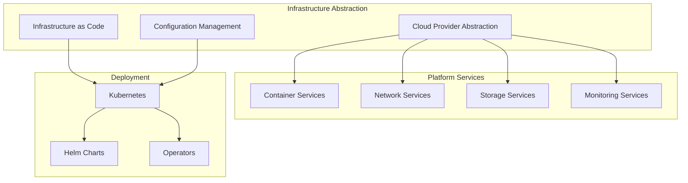
```mermaid
graph TB
    subgraph "Infrastructure Abstraction"
        CPA["Cloud Provider Abstraction"]
        IaC["Infrastructure as Code"]
        CM["Configuration Management"]
    end

    subgraph "Platform Services"
        CS["Container Services"]
        NS["Network Services"]
        SS["Storage Services"]
        MS["Monitoring Services"]
    end

    subgraph "Deployment"
        K8S["Kubernetes"]
        HELM["Helm Charts"]
        OPS["Operators"]
    end

    CPA --> CS
    CPA --> NS
    CPA --> SS
    CPA --> MS
    
    IaC --> K8S
    K8S --> HELM
    K8S --> OPS
    CM --> K8S
```

#### Implementation Approach
1. **Infrastructure**
   - Cloud-agnostic abstractions
   - Infrastructure as Code
   - Containerization
   - Service mesh

2. **Platform Services**
   - Pluggable cloud services
   - Abstract interfaces
   - Feature detection
   - Fallback mechanisms

### 8. Distributed Caching

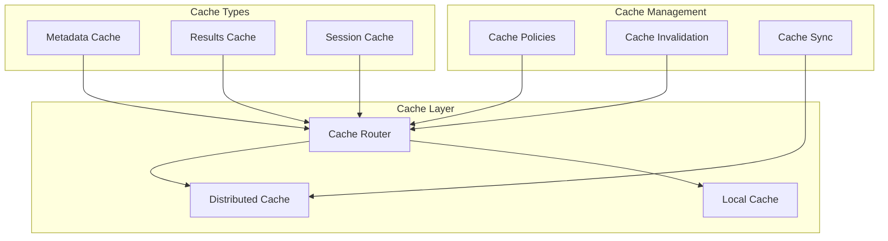
```mermaid
graph TB
    subgraph "Cache Layer"
        LC["Local Cache"]
        DC["Distributed Cache"]
        CR["Cache Router"]
    end

    subgraph "Cache Management"
        CP["Cache Policies"]
        CI["Cache Invalidation"]
        CS["Cache Sync"]
    end

    subgraph "Cache Types"
        MC["Metadata Cache"]
        RC["Results Cache"]
        SC["Session Cache"]
    end

    CR --> LC
    CR --> DC
    
    CP --> CR
    CI --> CR
    CS --> DC
    
    MC --> CR
    RC --> CR
    SC --> CR
```

#### Implementation Approach
1. **Cache Strategy**
   - Multi-level caching
   - Cache coherence
   - Eviction policies
   - Cache warming

2. **Performance Optimization**
   - Read-through caching
   - Write-behind caching
   - Cache partitioning
   - Cache replication

### 9. Data Ingestion

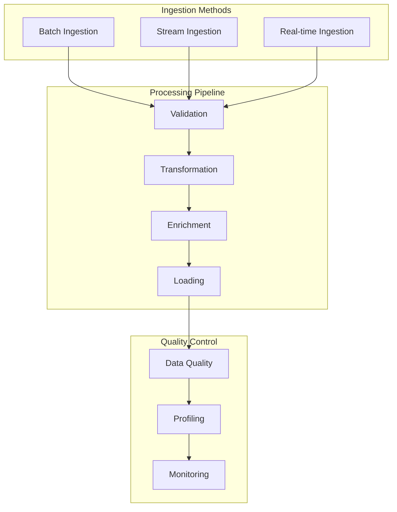
```mermaid
graph TB
    subgraph "Ingestion Methods"
        BI["Batch Ingestion"]
        SI["Stream Ingestion"]
        RI["Real-time Ingestion"]
    end

    subgraph "Processing Pipeline"
        VP["Validation"]
        TR["Transformation"]
        EN["Enrichment"]
        LO["Loading"]
    end

    subgraph "Quality Control"
        DQ["Data Quality"]
        PR["Profiling"]
        MO["Monitoring"]
    end

    BI --> VP
    SI --> VP
    RI --> VP
    
    VP --> TR
    TR --> EN
    EN --> LO
    
    LO --> DQ
    DQ --> PR
    PR --> MO
```

#### Implementation Approach
1. **Ingestion Patterns**
   - Batch processing
   - Stream processing
   - Change data capture
   - Real-time updates

2. **Processing Pipeline**
   - Data validation
   - Transformation
   - Enrichment
   - Quality checks

3. **Quality Control**
   - Data profiling
   - Data monitoring
   - Data quality metrics

### 10. Notification System

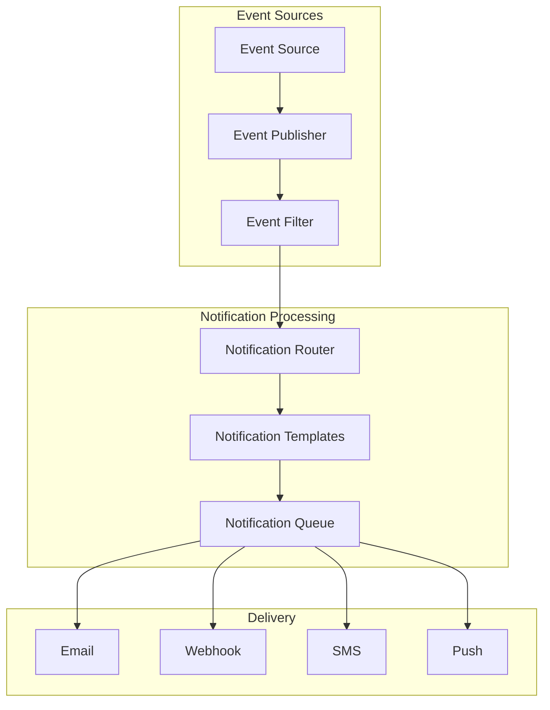
```mermaid
graph TB
    subgraph "Event Sources"
        ES["Event Source"]
        EP["Event Publisher"]
        EF["Event Filter"]
    end

    subgraph "Notification Processing"
        NR["Notification Router"]
        NT["Notification Templates"]
        NQ["Notification Queue"]
    end

    subgraph "Delivery"
        EM["Email"]
        WH["Webhook"]
        SMS["SMS"]
        PP["Push"]
    end

    ES --> EP
    EP --> EF
    EF --> NR
    
    NR --> NT
    NT --> NQ
    
    NQ --> EM
    NQ --> WH
    NQ --> SMS
    NQ --> PP
```

#### Implementation Approach
1. **Event Processing**
   - Event sourcing
   - Event filtering
   - Event routing
   - Event correlation

2. **Delivery Mechanisms**
   - Multiple channels
   - Delivery guarantees
   - Rate limiting
   - Retry mechanisms

### 11. Scalability and Extensibility

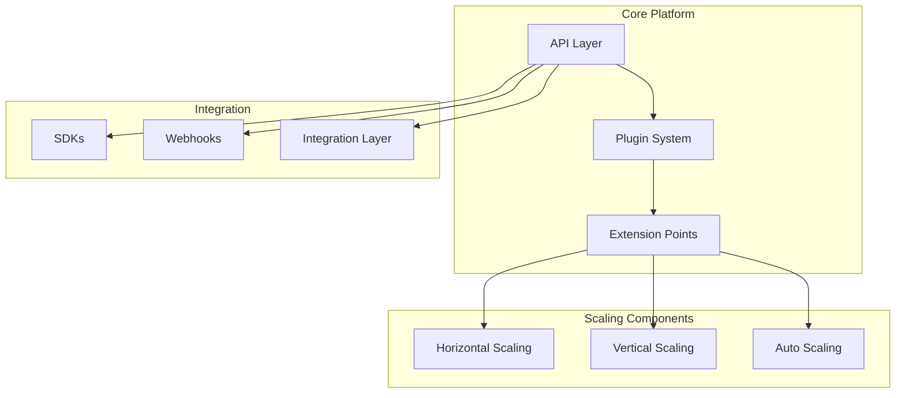
```mermaid
graph TB
    subgraph "Core Platform"
        API["API Layer"]
        PLUG["Plugin System"]
        EXT["Extension Points"]
    end

    subgraph "Scaling Components"
        HS["Horizontal Scaling"]
        VS["Vertical Scaling"]
        AS["Auto Scaling"]
    end

    subgraph "Integration"
        SDK["SDKs"]
        WH["Webhooks"]
        INT["Integration Layer"]
    end

    API --> PLUG
    PLUG --> EXT
    
    EXT --> HS
    EXT --> VS
    EXT --> AS
    
    API --> SDK
    API --> WH
    API --> INT
```

#### Implementation Approach
1. **Platform Extension**
   - Plugin architecture
   - Custom processors
   - Extension points
   - SDK support

2. **Scaling Strategy**
   - Horizontal scaling
   - Service mesh
   - Load balancing
   - Auto-scaling

3. **Integration**
   - SDKs for integration
   - Webhooks for event-driven integration
   - Integration layer for third-party services

### 12. Innovation and AI Integration

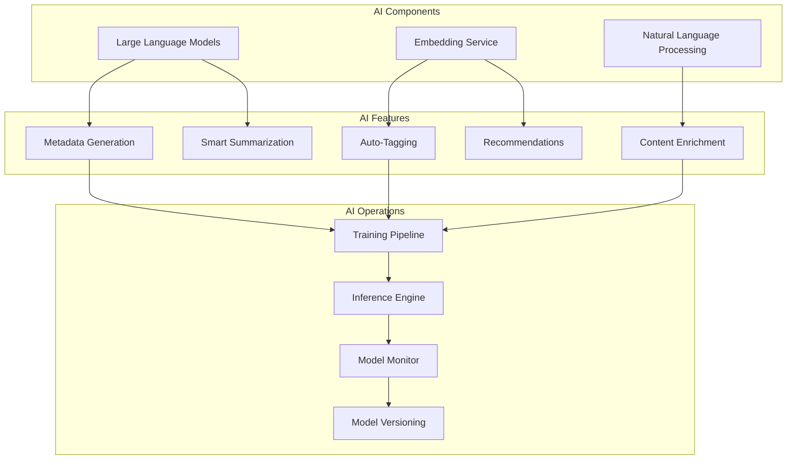
```mermaid
graph TB
    subgraph "AI Components"
        LLM["Large Language Models"]
        EMB["Embedding Service"]
        NLP["Natural Language Processing"]
    end

    subgraph "AI Features"
        MDG["Metadata Generation"]
        AUT["Auto-Tagging"]
        ENR["Content Enrichment"]
        SUM["Smart Summarization"]
        REC["Recommendations"]
    end

    subgraph "AI Operations"
        TRN["Training Pipeline"]
        INF["Inference Engine"]
        MON["Model Monitor"]
        VER["Model Versioning"]
    end

    LLM --> MDG
    LLM --> SUM
    EMB --> AUT
    EMB --> REC
    NLP --> ENR
    
    MDG --> TRN
    AUT --> TRN
    ENR --> TRN
    
    TRN --> INF
    INF --> MON
    MON --> VER
```

#### Implementation Details

1. **LLM Integration Layer**
   - Model Hub integration (OpenAI, Anthropic, etc.)
   - Custom model fine-tuning capabilities
   - Model performance monitoring
   - Cost optimization strategies
   - Fallback mechanisms

2. **AI-Powered Features**
   - Automated metadata generation
   - Smart tagging and classification
   - Content summarization
   - Relationship inference
   - Quality assessment
   - Anomaly detection

3. **AI Operations Management**
   - Model versioning and rollback
   - A/B testing framework
   - Performance monitoring
   - Resource optimization
   - Training pipeline automation

### 13. Advanced Analytics Architecture

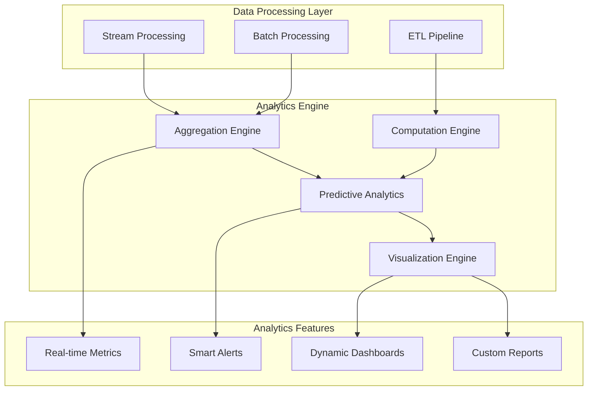
```mermaid
graph TB
    subgraph "Data Processing Layer"
        STR["Stream Processing"]
        BAT["Batch Processing"]
        ETL["ETL Pipeline"]
    end

    subgraph "Analytics Engine"
        AGG["Aggregation Engine"]
        CMP["Computation Engine"]
        PRD["Predictive Analytics"]
        VIZ["Visualization Engine"]
    end

    subgraph "Analytics Features"
        RPT["Custom Reports"]
        DSH["Dynamic Dashboards"]
        MTR["Real-time Metrics"]
        ALT["Smart Alerts"]
    end

    STR --> AGG
    BAT --> AGG
    ETL --> CMP
    
    AGG --> PRD
    CMP --> PRD
    PRD --> VIZ
    
    VIZ --> RPT
    VIZ --> DSH
    AGG --> MTR
    PRD --> ALT
```

#### Implementation Details

1. **Real-time Analytics**
   - Stream processing for live metrics
   - Real-time aggregation pipeline
   - Dynamic dashboard updates
   - Automated alert generation
   - Performance monitoring

2. **Batch Analytics**
   - Historical data analysis
   - Trend identification
   - Pattern recognition
   - Capacity planning
   - Usage analytics

3. **Visualization & Reporting**
   - Interactive dashboards
   - Custom report builder
   - Export capabilities
   - Scheduled reports
   - Embedded analytics

### 14. Contextual Query Architecture

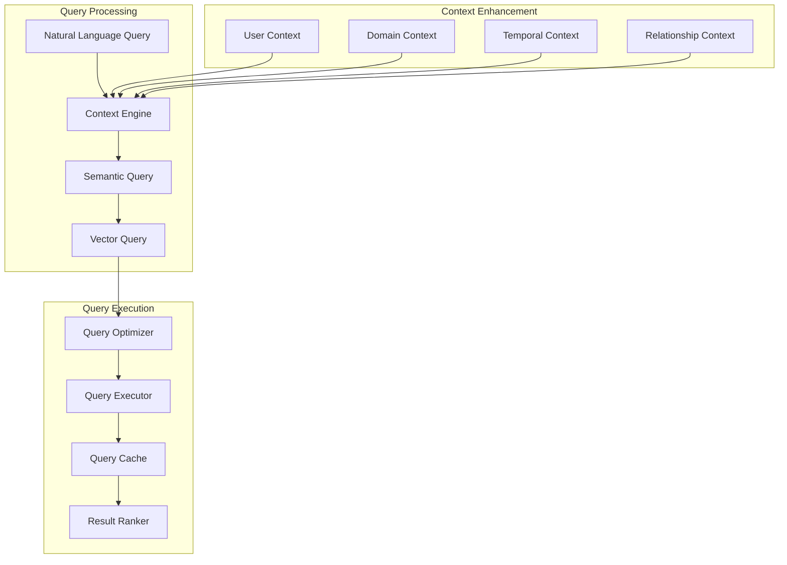
```mermaid
graph TB
    subgraph "Query Processing"
        NLQ["Natural Language Query"]
        CXQ["Context Engine"]
        SMQ["Semantic Query"]
        VCQ["Vector Query"]
    end

    subgraph "Context Enhancement"
        USR["User Context"]
        DOM["Domain Context"]
        TMP["Temporal Context"]
        REL["Relationship Context"]
    end

    subgraph "Query Execution"
        OPT["Query Optimizer"]
        EXE["Query Executor"]
        CAC["Query Cache"]
        RNK["Result Ranker"]
    end

    NLQ --> CXQ
    CXQ --> SMQ
    SMQ --> VCQ
    
    USR --> CXQ
    DOM --> CXQ
    TMP --> CXQ
    REL --> CXQ
    
    VCQ --> OPT
    OPT --> EXE
    EXE --> CAC
    CAC --> RNK
```

#### Implementation Details

1. **Natural Language Processing**
   - Intent recognition
   - Entity extraction
   - Query understanding
   - Context awareness
   - Disambiguation

2. **Context Management**
   - User preference tracking
   - Session context
   - Historical context
   - Domain-specific context
   - Relationship context

3. **Query Optimization**
   - Query planning
   - Cost-based optimization
   - Cache utilization
   - Result ranking
   - Performance tuning

### 15. Integration Points and Data Flow

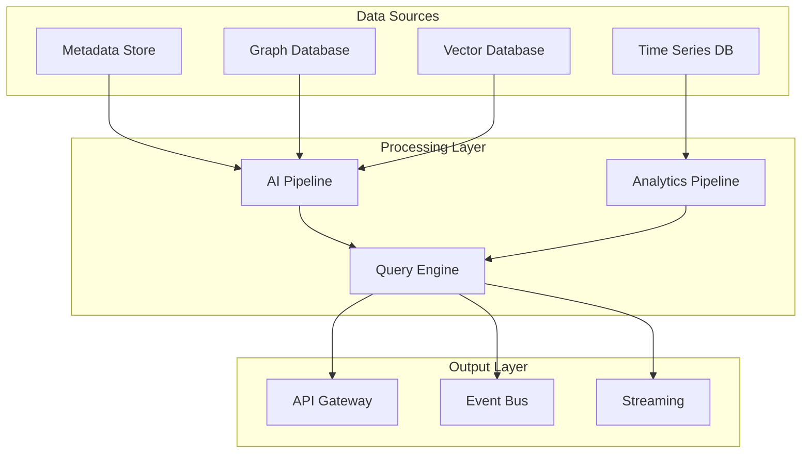
```mermaid
graph TB
    subgraph "Data Sources"
        MDS["Metadata Store"]
        GDB["Graph Database"]
        VDB["Vector Database"]
        TSB["Time Series DB"]
    end

    subgraph "Processing Layer"
        AIP["AI Pipeline"]
        ANP["Analytics Pipeline"]
        QEP["Query Engine"]
    end

    subgraph "Output Layer"
        API["API Gateway"]
        EVT["Event Bus"]
        STR["Streaming"]
    end

    MDS --> AIP
    GDB --> AIP
    VDB --> AIP
    TSB --> ANP
    
    AIP --> QEP
    ANP --> QEP
    QEP --> API
    QEP --> EVT
    QEP --> STR
```

#### Implementation Details

1. **Data Integration**
   - Unified data access layer
   - Data synchronization
   - Schema management
   - Version control
   - Change tracking

2. **Processing Integration**
   - Pipeline orchestration
   - Resource management
   - Error handling
   - Performance monitoring
   - Scalability management

3. **Output Integration**
   - API management
   - Event handling
   - Stream processing
   - Cache management
   - Load balancing

### 16. Security and Compliance

```mermaid
graph TB
    subgraph "Security Controls"
        ACC["Access Control"]
        ENC["Encryption"]
        AUD["Audit Trail"]
        MAS["Data Masking"]
    end

    subgraph "Compliance"
        GDP["GDPR"]
        HIP["HIPAA"]
        SOX["SOX"]
        PCI["PCI DSS"]
    end

    subgraph "Monitoring"
        LOG["Logging"]
        ALT["Alerting"]
        REP["Reporting"]
        ANA["Analytics"]
    end

    ACC --> LOG
    ENC --> LOG
    AUD --> LOG
    MAS --> LOG
    
    LOG --> GDP
    LOG --> HIP
    LOG --> SOX
    LOG --> PCI
    
    LOG --> ALT
    ALT --> REP
    REP --> ANA
```

#### Implementation Details

1. **Security Implementation**
   - Role-based access control
   - End-to-end encryption
   - Audit logging
   - Data masking
   - Secure communication

2. **Compliance Management**
   - Policy enforcement
   - Compliance monitoring
   - Regular audits
   - Report generation
   - Violation alerts

3. **Monitoring System**
   - Real-time monitoring
   - Alert management
   - Compliance reporting
   - Security analytics
   - Incident response

## Innovation and Disruptive Technologies Integration

### 1. Generative AI Integration Architecture

```mermaid
graph TB
    subgraph "AI Service Layer"
        LLM["LLM Service"]
        EMB["Embedding Service"]
        NLP["NLP Engine"]
    end

    subgraph "AI Features"
        MDG["Metadata Generation"]
        AUT["Auto-Tagging"]
        ENR["Content Enrichment"]
        SUM["Smart Summarization"]
        REC["Recommendations"]
    end

    subgraph "AI Operations"
        TRN["Training Pipeline"]
        INF["Inference Engine"]
        MON["Model Monitor"]
        VER["Model Versioning"]
    end

    LLM --> MDG
    LLM --> SUM
    EMB --> AUT
    EMB --> REC
    NLP --> ENR
    
    MDG --> TRN
    AUT --> TRN
    ENR --> TRN
    
    TRN --> INF
    INF --> MON
    MON --> VER
```

#### Implementation Details

1. **LLM Integration Layer**
   - Model Hub integration (OpenAI, Anthropic, etc.)
   - Custom model fine-tuning capabilities
   - Model performance monitoring
   - Cost optimization strategies
   - Fallback mechanisms

2. **AI-Powered Features**
   - Automated metadata generation
   - Smart tagging and classification
   - Content summarization
   - Relationship inference
   - Quality assessment
   - Anomaly detection

3. **AI Operations Management**
   - Model versioning and rollback
   - A/B testing framework
   - Performance monitoring
   - Resource optimization
   - Training pipeline automation

### 2. Advanced Analytics Architecture

```mermaid
graph TB
    subgraph "Data Processing Layer"
        STR["Stream Processing"]
        BAT["Batch Processing"]
        ETL["ETL Pipeline"]
    end

    subgraph "Analytics Engine"
        AGG["Aggregation Engine"]
        CMP["Computation Engine"]
        PRD["Predictive Analytics"]
        VIZ["Visualization Engine"]
    end

    subgraph "Analytics Features"
        RPT["Custom Reports"]
        DSH["Dynamic Dashboards"]
        MTR["Real-time Metrics"]
        ALT["Smart Alerts"]
    end

    STR --> AGG
    BAT --> AGG
    ETL --> CMP
    
    AGG --> PRD
    CMP --> PRD
    PRD --> VIZ
    
    VIZ --> RPT
    VIZ --> DSH
    AGG --> MTR
    PRD --> ALT
```

#### Implementation Details

1. **Real-time Analytics**
   - Stream processing for live metrics
   - Real-time aggregation pipeline
   - Dynamic dashboard updates
   - Automated alert generation
   - Performance monitoring

2. **Batch Analytics**
   - Historical data analysis
   - Trend identification
   - Pattern recognition
   - Capacity planning
   - Usage analytics

3. **Visualization & Reporting**
   - Interactive dashboards
   - Custom report builder
   - Export capabilities
   - Scheduled reports
   - Embedded analytics

### 3. Contextual Query Architecture

```mermaid
graph TB
    subgraph "Query Processing"
        NLQ["Natural Language Query"]
        CXQ["Context Engine"]
        SMQ["Semantic Query"]
        VCQ["Vector Query"]
    end

    subgraph "Context Enhancement"
        USR["User Context"]
        DOM["Domain Context"]
        TMP["Temporal Context"]
        REL["Relationship Context"]
    end

    subgraph "Query Execution"
        OPT["Query Optimizer"]
        EXE["Query Executor"]
        CAC["Query Cache"]
        RNK["Result Ranker"]
    end

    NLQ --> CXQ
    CXQ --> SMQ
    SMQ --> VCQ
    
    USR --> CXQ
    DOM --> CXQ
    TMP --> CXQ
    REL --> CXQ
    
    VCQ --> OPT
    OPT --> EXE
    EXE --> CAC
    CAC --> RNK
```

#### Implementation Details

1. **Natural Language Processing**
   - Intent recognition
   - Entity extraction
   - Query understanding
   - Context awareness
   - Disambiguation

2. **Context Management**
   - User preference tracking
   - Session context
   - Historical context
   - Domain-specific context
   - Relationship context

3. **Query Optimization**
   - Query planning
   - Cost-based optimization
   - Cache utilization
   - Result ranking
   - Performance tuning

