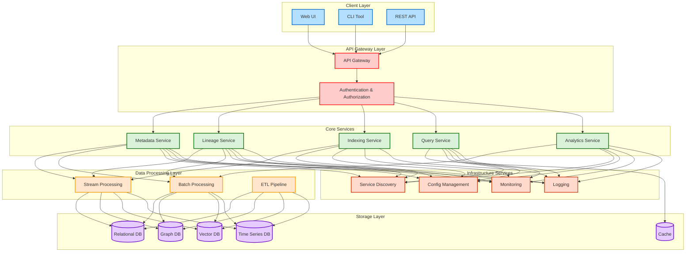
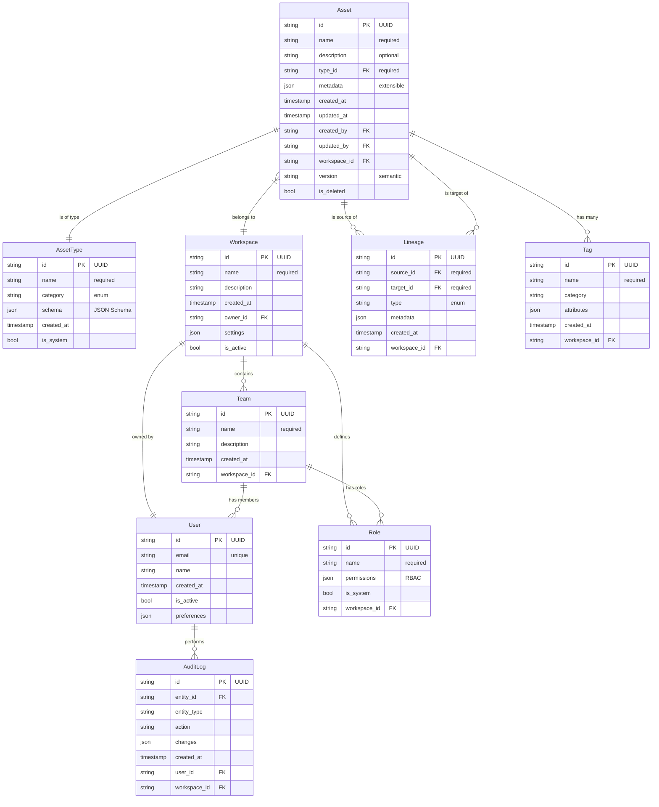

# Metadata Platform Design Document

## Table of Contents

1. [Introduction](#introduction)
2. [System Requirements](#system-requirements)
3. [Architecture Overview](#architecture-overview)
4. [Component Design](#component-design)
5. [Data Model](#data-model)
6. [API Design](#api-design)
7. [Security & Compliance](#security--compliance)
8. [Deployment Strategy](#deployment-strategy)
9. [Scalability & Performance](#scalability--performance)
10. [Cost Optimization](#cost-optimization)
11. [Monitoring & Observability](#monitoring--observability)
12. [Technology Stack](#technology-stack)
13. [Key Architectural Considerations](#key-architectural-considerations)
14. [Existing Metadata Engines Analysis](#existing-metadata-engines-analysis)
15. [References](#references)

## Introduction

The MetaPlatform is an enterprise-grade metadata management system designed to address the challenges of modern data ecosystems. It provides comprehensive tools for managing, searching, and analyzing metadata across diverse data sources. Built with scalability, security, and extensibility in mind, the platform supports multi-tenancy and integrates seamlessly with cloud-native and on-premises environments.

## System Requirements

### Functional Requirements

1. **Metadata Management**
   - Asset registration and lifecycle management
   - Schema validation and evolution
   - Custom attributes and extensions
   - Bulk operations with transactional support
   - Version control with Git-like branching

2. **Search & Discovery**
   - Multi-modal search (text, vector, graph)
   - Query federation across stores
   - Real-time indexing pipeline
   - Custom ranking algorithms
   - Advanced query optimization

3. **Integration Capabilities**
   - REST APIs
   - Webhook support
   - Streaming interfaces
   - Batch processing

4. **Access Control**
   - Role-based access control (RBAC)
   - Attribute-based access control (ABAC)
   - Fine-grained permissions
   - Multi-tenancy support
   - SSO integration

### Non-Functional Requirements

1. **Performance**
   - Sub-second search response time
   - Support for billions of metadata assets
   - High throughput for batch operations
   - Low latency for real-time updates

2. **Scalability**
   - Horizontal scalability
   - Auto-scaling capabilities
   - Load balancing
   - Distributed processing

3. **Availability**
   - 99.99% uptime
   - Disaster recovery
   - Geographic redundancy
   - Zero-downtime updates

4. **Security**
   - End-to-end encryption
   - Audit logging
   - Compliance with industry standards
   - Data governance

## Architecture Overview

The MetaPlatform architecture follows a modern, cloud-native microservices approach with emphasis on scalability, resilience, and extensibility.





### Core Components

1. **Client Layer**
   - Web UI: Modern React-based interface
   - CLI Tool: Command-line interface for automation
   - REST API: RESTful endpoints for external integration

2. **API Gateway Layer**
   - API Gateway: Request routing and composition
   - Authentication & Authorization: OAuth2/OIDC-based security

3. **Core Services**
   - Metadata Service: Central metadata management
   - Lineage Service: Data lineage tracking
   - Indexing Service: Search and discovery
   - Query Service: Advanced query processing
   - Analytics Service: Metadata analytics

4. **Data Processing Layer**
   - Stream Processing: Real-time metadata updates
   - Batch Processing: Large-scale analytics
   - ETL Pipeline: Data integration

5. **Storage Layer**
   - Relational DB: Structured metadata
   - Graph DB: Relationships and lineage
   - Vector DB: Similarity search
   - Time Series DB: Historical tracking
   - Cache: Performance optimization

6. **Infrastructure Services**
   - Service Discovery: Dynamic service registration
   - Config Management: Centralized configuration
   - Monitoring: Health and metrics
   - Logging: Centralized logging

### Design Principles

1. **Modularity**: Each component is independently deployable
2. **Scalability**: Horizontal scaling of services
3. **Resilience**: Fault tolerance and auto-scaling
4. **Security**: Zero-trust architecture

## Component Design

### Core Services

1. **Metadata Service**
   - Asset registration and lifecycle management
   - Schema validation and evolution
   - Custom attributes and extensions
   - Bulk operations with transactional support
   - Version control with Git-like branching

2. **Lineage Service**
   - DAG-based lineage tracking
   - Impact analysis and root cause detection
   - Automated lineage inference
   - Custom lineage rules engine
   - Provenance tracking

3. **Search Service**
   - Multi-modal search (text, vector, graph)
   - Query federation across stores
   - Real-time indexing pipeline
   - Custom ranking algorithms
   - Advanced query optimization

4. **Analytics Service**
   - Real-time metrics computation
   - Custom aggregation pipelines
   - Time-series analysis
   - Anomaly detection
   - Trend analysis

### Data Processing

1. **Stream Processing**
   - Technology: Kafka (3.x) + Flink (1.17)
   - Use Cases:
     * Real-time metadata updates
     * Incremental indexing
     * Event processing
     * Notification delivery

2. **Batch Processing**
   - Technology: Spark (3.x)
   - Use Cases:
     * Large-scale analytics
     * Bulk data processing
     * Historical analysis
     * Data quality checks

3. **Workflow Orchestration**
   - Technology: Airflow (2.x)
   - Use Cases:
     * ETL pipeline management
     * Job scheduling
     * Dependency management
     * Error handling

### Storage Strategy

1. **Primary Store**
   - Technology: PostgreSQL 15 + pgvector
   - Purpose: Core metadata storage
   - Features:
     * ACID compliance
     * Vector similarity search
     * JSON/JSONB support
     * Row-level security

2. **Graph Store**
   - Technology: Neo4j 5.x
   - Purpose: Relationship management
   - Features:
     * Native graph processing
     * Cypher query language
     * Graph algorithms
     * Visualization support

3. **Time Series Store**
   - Technology: Druid/Pinot
   - Purpose: Time series data storage
   - Features:
     * Time-based partitioning
     * Retention policies
     * Continuous queries
     * Downsampling

4. **Cache Layer**
   - Technology: Redis 7.x
   - Purpose: Performance optimization
   - Features:
     * Multi-level caching
     * Rate limiting

### Security Architecture

1. **Authentication**
   - OAuth2/OIDC integration
   - MFA support
   - SSO capabilities
   - Token management

2. **Authorization**
   - RBAC/ABAC unified model
   - Dynamic policy evaluation
   - Resource-level permissions
   - Tenant isolation

3. **Audit**
   - Comprehensive audit logging
   - Tamper-evident logs
   - Compliance reporting
   - Retention policies

### Monitoring & Observability

1. **Metrics**
   - RED metrics (Rate, Errors, Duration)
   - Custom business metrics
   - SLO/SLA tracking
   - Capacity planning

2. **Logging**
   - Structured logging
   - Log aggregation
   - Log analysis
   - Alert correlation

3. **Tracing**
   - Distributed tracing
   - Performance profiling
   - Bottleneck analysis
   - Error tracking

## Data Model




### Core Entities

1. **Asset**
   - Asset registration and lifecycle management
   - Schema validation and evolution
   - Custom attributes and extensions
   - Bulk operations with transactional support
   - Version control with Git-like branching

2. **AssetType**
   - Defines the schema and behavior of assets
   - Custom attributes via schema
   - Pluggable type system

3. **Workspace**
   - Multi-tenant isolation boundary
   - Hierarchical resource organization
   - Cross-workspace references supported

### Relationship Entities

1. **Lineage**
   - Tracks data flow and dependencies
   - Impact analysis and root cause detection
   - Automated lineage inference
   - Custom lineage rules engine
   - Provenance tracking

2. **Tag**
   - Flexible categorization and labeling
   - Custom attributes via schema
   - Pluggable type system

### Security Entities

1. **User**
   - Platform user information
   - Multi-factor authentication
   - Single sign-on integration

2. **Team**
   - Organizational grouping
   - Role-based access control
   - Attribute-based access control

3. **Role**
   - Permission sets and access control
   - Dynamic policy evaluation
   - Resource-level permissions
   - Tenant isolation

### Audit Entities

1. **AuditLog**
   - Comprehensive change tracking
   - Tamper-evident logs
   - Compliance reporting
   - Retention policies
     
### Key Design Decisions

1. **Multi-tenancy**
   - Workspace-based isolation
   - Hierarchical resource organization
   - Cross-workspace references supported

2. **Extensibility**
   - JSON metadata fields for flexibility
   - Custom attributes via schema
   - Pluggable type system

3. **Versioning**
   - Semantic versioning for assets
   - Full audit history
   - Soft deletion support

4. **Security**
   - Fine-grained RBAC
   - Team-based access control
   - Audit logging for compliance


## API Design

### OpenAPI Specification

```yaml
openapi: 3.0.3
info:
  title: MetaPlatform API
  description: Enterprise Metadata Platform API
  version: 1.0.0
  contact:
    name: MetaPlatform Team
    url: https://metaplatform.io
  license:
    name: Proprietary
    
servers:
  - url: https://api.metaplatform.io/v1
    description: Production server
  - url: https://staging-api.metaplatform.io/v1
    description: Staging server

security:
  - bearerAuth: []
  - apiKeyAuth: []

components:
  securitySchemes:
    bearerAuth:
      type: http
      scheme: bearer
      bearerFormat: JWT
    apiKeyAuth:
      type: apiKey
      in: header
      name: X-API-Key

  schemas:
    Asset:
      type: object
      required:
        - id
        - name
        - type
        - workspaceId
      properties:
        id:
          type: string
          format: uuid
        name:
          type: string
          maxLength: 255
        description:
          type: string
        type:
          type: string
          enum: [table, dashboard, pipeline, model, api]
        workspaceId:
          type: string
          format: uuid
        metadata:
          type: object
          additionalProperties: true
        tags:
          type: array
          items:
            type: string
        owner:
          type: string
        created:
          type: string
          format: date-time
        updated:
          type: string
          format: date-time
        version:
          type: integer
          minimum: 1

    AssetCreate:
      type: object
      required:
        - name
        - type
        - workspaceId
      properties:
        name:
          type: string
          maxLength: 255
        description:
          type: string
        type:
          type: string
          enum: [table, dashboard, pipeline, model, api]
        workspaceId:
          type: string
          format: uuid
        metadata:
          type: object
          additionalProperties: true
        tags:
          type: array
          items:
            type: string

    LineageGraph:
      type: object
      properties:
        nodes:
          type: array
          items:
            $ref: '#/components/schemas/Asset'
        edges:
          type: array
          items:
            type: object
            properties:
              source:
                type: string
                format: uuid
              target:
                type: string
                format: uuid
              relationship:
                type: string
              metadata:
                type: object
                additionalProperties: true

    SearchRequest:
      type: object
      properties:
        query:
          type: string
        filters:
          type: object
          properties:
            types:
              type: array
              items:
                type: string
            tags:
              type: array
              items:
                type: string
            workspaceIds:
              type: array
              items:
                type: string
                format: uuid
        pagination:
          type: object
          properties:
            page:
              type: integer
              minimum: 1
            size:
              type: integer
              minimum: 1
              maximum: 100

    SearchResponse:
      type: object
      properties:
        items:
          type: array
          items:
            $ref: '#/components/schemas/Asset'
        total:
          type: integer
        page:
          type: integer
        size:
          type: integer

    Error:
      type: object
      properties:
        code:
          type: string
        message:
          type: string
        details:
          type: object
          additionalProperties: true
        traceId:
          type: string
```

### API Features

1. **Authentication & Authorization**
   - JWT Bearer token authentication
   - API Key authentication
   - Role-based access control

2. **Versioning & Compatibility**
   - URL-based versioning (/v1)
   - Backward compatibility guarantees
   - Deprecation notices

3. **Error Handling**
   - Standardized error responses
   - Detailed error messages
   - Request tracing

4. **Rate Limiting & Quotas**
   - Per-client rate limits
   - Usage quotas
   - Burst handling

5. **Documentation**
   - OpenAPI/Swagger specification
   - Interactive API documentation
   - Code samples and SDKs

## Security & Compliance

### Authentication & Authorization

1. **Identity Management**
   - OAuth 2.0 / OpenID Connect
   - SAML 2.0
   - JWT tokens
   - API keys

2. **Access Control**
   - RBAC (Role-Based Access Control)
   - ABAC (Attribute-Based Access Control)
   - Policy enforcement points
   - Tenant isolation

### Data Security

1. **Encryption**
   - Data at rest encryption
   - TLS 1.3 for data in transit
   - Key management service
   - Hardware security modules (HSM)

2. **Audit & Compliance**
   - Comprehensive audit logs
   - GDPR compliance
   - CCPA compliance
   - SOC 2 compliance

## Deployment Strategy

### Deployment Models

1. **Single-Region Deployment**
   - Suitable for small to medium enterprises
   - Lower operational costs
   - Simplified management
   - Basic disaster recovery

2. **Multi-Region Active-Active vs  Active-Passive**
   - Global data distribution
   - Low-latency access
   - High availability
   - Disaster recovery
   - Geographic redundancy

### Deployment Process

1. **Infrastructure Provisioning**
   - Terraform for infrastructure as code
   - CloudFormation/Ansible for resource management

2. **Application Deployment**
   - Docker for containerization
   - Kubernetes for orchestration
   - Helm for package management
   - ArgoCD for CI/CD

3. **Release Strategy**
   - Blue-Green deployments
   - Canary releases
   - Feature flags
   - Rollback procedures

### Scaling Strategy

1. **Horizontal Scaling**
   - Auto-scaling policies
   - Load-based scaling
   - Scheduled scaling
   - Resource quotas

2. **Vertical Scaling**
   - Resource allocation
   - Performance tuning
   - Capacity planning
   - Cost optimization

3. **Data Scaling**
   - Sharding strategy
   - Replication setup
   - Backup procedures
   - Archive policies

## Scalability & Performance

### Performance Optimization

1. **Caching Strategy**
   - Multi-level caching
   - Cache invalidation
   - Cache warming
   - Cache coherence

2. **Query Optimization**
   - Query planning
   - Index optimization
   - Query caching
   - Materialized views

## Cost Optimization

### Infrastructure Costs

1. **Compute Optimization**
   - Right-sizing instances
   - Spot instances usage
   - Auto-scaling policies
   - Resource quotas

2. **Storage Optimization**
   - Tiered storage
   - Data lifecycle policies
   - Compression
   - Deduplication

### Operational Costs

1. **Automation**
   - CI/CD pipelines
   - Infrastructure as Code
   - Automated testing
   - Self-healing systems

2. **Resource Management**
   - Cost allocation
   - Budget alerts
   - Usage monitoring
   - Waste elimination

## Monitoring & Observability

### Metrics Collection

1. **System Metrics**
   - CPU usage
   - Memory utilization
   - Network throughput
   - Disk I/O

2. **Application Metrics**
   - Request latency
   - Error rates
   - Throughput
   - Success rates

### Logging & Tracing

1. **Log Management**
   - Centralized logging
   - Log retention policies
   - Log analysis
   - Alert generation

2. **Distributed Tracing**
   - Request tracing
   - Performance profiling
   - Bottleneck analysis
   - Error tracking

## Technology Stack

| Category | Primary Choice | Alternatives | Tradeoffs |
|----------|---------------|--------------|-----------|
| **Core Platform** |
| Language | Java 21 | Go, Rust | - Java: Better ecosystem, more developers, stable releases<br>- Go: More concise, null safety, better Concurrency<br>- Rust: Powerful FP features but steeper learning curve, Better resource utilization |
| Framework | Spring Boot 3.x | Micronaut, Quarkus | - Spring Boot: Mature ecosystem, extensive documentation<br>- Micronaut: Lower memory footprint, faster startup<br>- Quarkus: Native compilation, better cloud-native features |
| Build Tool | Gradle 8.x | Maven | - Gradle: Flexible DSL, better performance, incremental builds<br>- Maven: Simpler structure, wider adoption |
| **Data Layer** |
| Primary DB | Amazon RDS (PostgreSQL 15) | Aurora PostgreSQL, CockroachDB | - RDS: Managed service, cost-effective<br>- Aurora: Better scalability but higher cost<br>- CockroachDB: Global distribution but complex ops |
| Graph DB | Neo4j| Neo4j | - Neptune: Managed service, AWS integration<br>- Neo4j: Rich feature set but higher ops overhead |
| Time Series | Apache Druid/Pinot(OLAP) | Clickhouse,Amazon Timestream   | - Timestream: Serverless, AWS integration<br>- Clickhouse: Rich query language<br>- Druid/Pinot: Better for high ingestion |
| Cache | Redis | Hazelcast, Apache Ignite | - Redis: Very mature, easy scaling<br>- Hazelcast: Better data structures<br>- Ignite: More features but complex |
| **Message Queue** |
| Event Bus | KAFKA | Amazon SQS, RabbitMQ | - KAFKA: High throughput, retention<br>- SQS: Simpler, serverless<br>- RabbitMQ: Better routing but scaling complexity |
| **Search** |
| Search Engine | Elasticsearch | Amazon OpenSearch, Solr | - OpenSearch: AWS integration, managed<br>- Elasticsearch: Rich features but license concerns<br>- Solr: Simpler but less scalable |
| **Processing** |
| Stream Processing | Apache Flink | Amazon Kinesis, Spark Streaming | - Kinesis: Managed, easy integration<br>- Flink: More features but complex ops<br>- Spark: Better batch+stream but heavy |
| Batch Processing | AWS EMR (Spark) | Apache Hadoop, AWS Batch | - EMR: Managed, scalable<br>- Hadoop: More control but complex<br>- AWS Batch: Simple but limited |
| **Infrastructure** |
| Container Orchestration | Amazon EKS | ECS, Fargate | - EKS: Standard K8s, more control<br>- ECS: Simpler but AWS-specific<br>- Fargate: Serverless but less control |
| Service Mesh | Istio | App Mesh, Linkerd | - App Mesh: AWS native, simpler<br>- Istio: More features but complex<br>- Linkerd: Lightweight but limited |
| **Monitoring** |
| Metrics | Prometheus & Grafana | AWS cloudWatch, New Relic, Dynadrace,DataDog | - CloudWatch: AWS integration<br>- Prometheus: Rich metrics but needs setup<br>- Grafana: Better visualization |
| Tracing | AWS X-Ray | Jaeger, Zipkin | - X-Ray: AWS integration<br>- Jaeger: More features<br>- Zipkin: Simpler but limited |
| **Security** |
| Identity | Amazon Cognito | Keycloak, Auth0 | - Cognito: AWS integration<br>- Keycloak: More features but self-managed<br>- Auth0: Feature-rich but costly |
| Secrets | AWS Secrets Manager | HashiCorp Vault | - Secrets Manager: AWS integration<br>- Vault: More features but complex |

### Implementation Notes:
1. **AWS-First Approach**: Primary choices favor AWS managed services for reduced operational overhead
2. **Java Ecosystem**: Core services built with Spring Boot for robust enterprise features
3. **Hybrid Capability**: While AWS-focused, architecture supports hybrid/multi-cloud deployment
4. **Cost-Performance Balance**: Choices consider both operational costs and performance requirements
5. **Operational Simplicity**: Preference for managed services to reduce maintenance overhead

## Key Architectural Considerations

### 1. Background Task Management
We handle long-running operations through a robust task management system:
- **Task Types**: Support for batch processing (like data imports), long-running tasks (data syncs), recurring tasks (scheduled updates), and priority-based tasks
- **Task Lifecycle**: Each task goes through states (queued, running, completed, failed) with proper tracking
- **Recovery**: Automatic retries for failed tasks, dead letter queues for investigation, and timeout handling
- **Monitoring**: Real-time progress tracking, metrics collection, and alerting for issues


### 2. Audit System
Comprehensive tracking of all system activities:
- **Event Collection**: Log all important actions with who, what, when, where details
- **Tamper-Proof**: Secure storage of audit logs that cannot be modified
- **Analysis**: Tools to investigate issues and generate compliance reports
- **Retention**: Configurable retention policies for different types of audit data

### 3. Multi-Tenant Architecture
Secure isolation between different organizations:
- **Data Isolation**: Each tenant's data is logically or physically separated
- **Resource Management**: Fair resource allocation with quotas and limits
- **Configuration**: Tenant-specific settings and customizations
- **Monitoring**: Track resource usage and performance per tenant


### 4. Notification System
Keep users informed of important events:
- **Channels**: Email, webhooks, in-app notifications, SMS
- **Templates**: Customizable message templates
- **Delivery**: Guaranteed delivery with retries
- **Preferences**: User-configurable notification settings


### 5. AI Integration
Enhance metadata management with AI:
- **Metadata Generation**: Automatically generate descriptions and tags
- **Classification**: Smart categorization of data assets
- **Recommendations**: Suggest related datasets and improvements
- **Quality**: AI-powered data quality assessment

### 6. Analytics Capabilities
Understand your metadata ecosystem:
- **Real-Time**: Live metrics and dashboards
- **Historical**: Trend analysis and reporting
- **Custom**: Build your own reports and visualizations
- **Alerts**: Smart alerting based on patterns and thresholds

### 7. Query Processing
Efficient and intelligent query handling:
- **Natural Language**: Query using plain English
- **Context-Aware**: Consider user context and preferences
- **Optimization**: Smart query routing and caching
- **Ranking**: Relevant results based on multiple factors

### 8. Integration Framework
Connect with your existing tools:
- **APIs**: REST and GraphQL interfaces
- **Events**: Real-time event streaming
- **Connectors**: Pre-built integrations with common tools
- **Custom**: Build your own integrations using SDKs

## Innovation and Disruptive Technologies Integration

### 1. Generative AI Integration Architecture

#### Core Components

1. **Language Model Service**
   - Primary: GPT-4 for advanced text generation and understanding
   - Backup: Claude 3.5 for specialized documentation tasks
   - Local: LLaMA 3.1 for sensitive data processing


2. **Embedding Service**
   - Technology: sentence-transformers for text embeddings
   - Vector Store: Pinecone for scalable similarity search
   - Batch Processing: Apache Spark for large-scale embedding generation
   - Real-time: Redis for fast vector lookup


#### Key Features

1. **Metadata Generation**
   - Automatic tag suggestion
   - Smart field population
   - Schema inference
   - Quality scoring
   - Confidence metrics

2. **Content Enhancement**
   - Automated summarization
   - Key phrase extraction
   - Entity recognition
   - Relationship inference
   - Semantic classification

3. **Smart Recommendations**
   - Similar content discovery
   - Usage pattern analysis
   - Contextual suggestions
   - Personalized rankings
   - Trend identification


### 2. Advanced Analytics Architecture

#### Core Components

1. **Processing Engine**
   - Stream Processing: Apache Flink
   - Batch Processing: Apache Spark
   - Storage: Apache Iceberg
   - Queue: Apache Kafka
   - Cache: Redis

2. **Computation Layer**
   - Framework: Apache Spark SQL
   - Time Series: Druid
   - Machine Learning: Spark MLlib
   - Statistics: StatsModels
   - Visualization: Apache Superset

3. **Delivery System**
   - API: REST/GraphQL for flexible queries
   - Cache: Redis for hot data
   - Export: Apache Parquet
   - Scheduling: Apache Airflow
   - Monitoring: Prometheus

#### Key Features

1. **Real-time Analytics**
   - Live metrics tracking
   - Streaming aggregations
   - Dynamic dashboards
   - Anomaly detection
   - Trend analysis

2. **Batch Processing**
   - Historical analysis
   - Complex aggregations
   - Pattern recognition
   - Predictive modeling
   - Resource optimization

3. **Reporting System**
   - Custom report builder
   - Scheduled exports
   - Interactive dashboards
   - Data exploration
   - Alert management


### 3. Contextual Query System

#### Core Components

1. **Query Processing**
   - Parser: ANTLR4
   - Optimizer: Custom query planner
   - Executor: Distributed query engine
   - Cache: Redis
   - Storage: PostgreSQL

2. **Context Engine**
   - User Context: Redis
   - Domain Context: Neo4j
   - Relationship: Neptune


3. **Query Enhancement**
   - Vector Search: Pinecone
   - Text Search: Elasticsearch
   - Ranking: Custom ML model
   - Caching: Redis
   - Analytics: Pinot/Druid/ClickHouse

#### Key Features

1. **Natural Language Understanding**
   - Intent recognition
   - Entity extraction
   - Query transformation
   - Context awareness
   - Disambiguation

2. **Context Management**
   - User preferences
   - Session tracking
   - History analysis
   - Domain rules
   - Security context

3. **Query Optimization**
   - Cost-based planning
   - Cache utilization
   - Parallel execution
   - Resource management
   - Performance monitoring


## Existing Metadata Engines Analysis

| Feature/Capability | Apache Atlas | OpenMetadata | DataHub | Amundsen | MetaPlatform Approach |
|-------------------|--------------|--------------|----------|-----------|---------------------|
| **Core Features** |
| Data Discovery | Basic search | Advanced search with relevancy | Graph-based discovery | Basic search with ranking | Advanced semantic search with ML-based relevancy and personalization |
| Metadata Model | Fixed schema | Extensible schema | Extensible schema | Fixed schema | Dynamic schema with custom extensions and versioning |
| Lineage Tracking | Table-level | Column-level | Both levels | Table-level | Multi-level (Column, Table, Job) with impact analysis |
| API Framework | REST | REST + GraphQL | GraphQL | REST | REST + GraphQL + gRPC for high performance |
| **Data Processing** |
| Real-time Updates | Limited | Yes | Yes | No | Stream-based real-time updates with CDC |
| Batch Processing | Yes | Yes | Yes | Yes | Distributed batch processing with prioritization |
| Custom Ingestion | Plugin-based | Connector-based | Connector-based | Limited | Modular connector framework with validation |
| **Advanced Features** |
| ML/AI Integration | No | Basic | Limited | No | Advanced ML for classification, quality, and recommendations |
| Data Quality | Basic | Yes | Yes | No | Comprehensive quality framework with SLA monitoring |
| Data Profiling | Limited | Yes | Yes | Basic | Real-time profiling with anomaly detection |
| **Security** |
| Access Control | Basic RBAC | RBAC + ABAC | Basic RBAC | Basic RBAC | Multi-level RBAC/ABAC with dynamic policies |
| Data Masking | No | Basic | No | No | Context-aware masking with encryption |
| Audit Logging | Basic | Detailed | Basic | Basic | Comprehensive audit with compliance reporting |
| **Integration** |
| Cloud Support | Limited | Multi-cloud | Multi-cloud | Limited | Native multi-cloud with hybrid capabilities |
| External Tools | Limited | Good | Good | Limited | Extensive API ecosystem with webhooks |
| Custom Extensions | Plugin-based | Limited | Yes | Limited | Modular plugin architecture with marketplace |
| **Scalability** |
| Horizontal Scaling | Limited | Yes | Yes | Limited | Auto-scaling with workload optimization |
| Performance | Moderate | Good | Good | Moderate | High-performance with caching and sharding |
| High Availability | Basic | Yes | Yes | Limited | Multi-region active-active deployment |
| **User Experience** |
| UI Customization | Limited | Moderate | Good | Limited | Fully customizable with white-labeling |
| Search Experience | Basic | Advanced | Advanced | Basic | AI-powered semantic search with facets |
| Visualization | Basic graphs | Interactive | Interactive | Basic graphs | Rich interactive visualizations with D3.js |
| **Unique Features** |
| Version Control | No | Basic | Yes | No | Git-like versioning for metadata |
| Impact Analysis | Basic | Yes | Yes | No | ML-based predictive impact analysis |
| Collaboration | No | Basic | Yes | Basic | Advanced collaboration with workflows |
| Data Governance | Basic | Yes | Yes | Limited | Comprehensive governance framework |

## References

### Books
- "Fundamentals of Metadata Management"
By Ole Olesen-Bagneux [O'Reilly](https://learning.oreilly.com/library/view/fundamentals-of-metadata/9781098162818/)
- "System Design on AWS" By Jayanth Kumar, Mandeep Singh [O'Reilly](https://learning.oreilly.com/library/view/system-design-on/9781098146887/)
- "Fundamentals of Data Engineering" by Joe Reis and Matt Housley [O'Reilly](https://www.oreilly.com/library/view/fundamentals-of-data/9781098108298/)
- "Data Mesh: Delivering Data-Driven Value at Scale" by Zhamak Dehghani [O'Reilly](https://www.oreilly.com/library/view/data-mesh/9781492092384/)
- "Designing Data-Intensive Applications" by Martin Kleppmann [O'Reilly](https://www.oreilly.com/library/view/designing-data-intensive-applications/9781491903063/)
- "Data Quality Fundamentals" by Barr Moses, Lior Gavish, Molly Vorwerck [O'Reilly](https://learning.oreilly.com/library/view/data-quality-fundamentals/9781098112035/)
- "Fundamentals of Data Observability" by Andy Petrella [O'Reilly](https://learning.oreilly.com/library/view/fundamentals-of-data/9781098133283/)
- "Building Event-Driven Microservices" by Adam Bellemare [O'Reilly](https://www.oreilly.com/library/view/building-event-driven-microservices/9781492057888/)
- "Cloud Native Patterns" by Cornelia Davis [Manning](https://www.manning.com/books/cloud-native-patterns)
- "Building Microservices" by Sam Newman [O'Reilly](https://www.oreilly.com/library/view/building-microservices-2nd/9781492034018/)
- "Microservices Patterns" by Chris Richardson [Manning](https://www.manning.com/books/microservices-patterns)
- "Microservices Security in Action" by Prabath Siriwardena and Nuwan Dias [Manning](https://www.manning.com/books/microservices-security-in-action)

### Technical Documentation
- [Apache Atlas Documentation](https://atlas.apache.org/)
- [OpenMetadata Documentation](https://docs.open-metadata.org/)
- [DataHub Documentation](https://datahubproject.io/)
- [Amundsen Documentation](https://www.amundsen.io/)

### Tools and Resources
- **Mermaid**: [Mermaid Documentation](https://mermaid-js.github.io/mermaid/#/) - Guide on creating diagrams with Mermaid.
- **Uber blogs**: [QueryGPT – Natural Language to SQL Using Generative AI](https://www.uber.com/en-IN/blog/query-gpt/)
